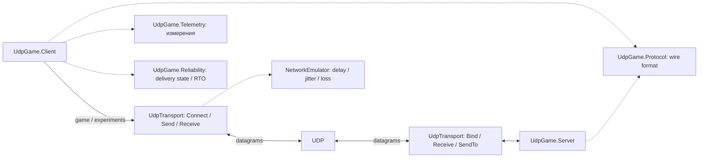
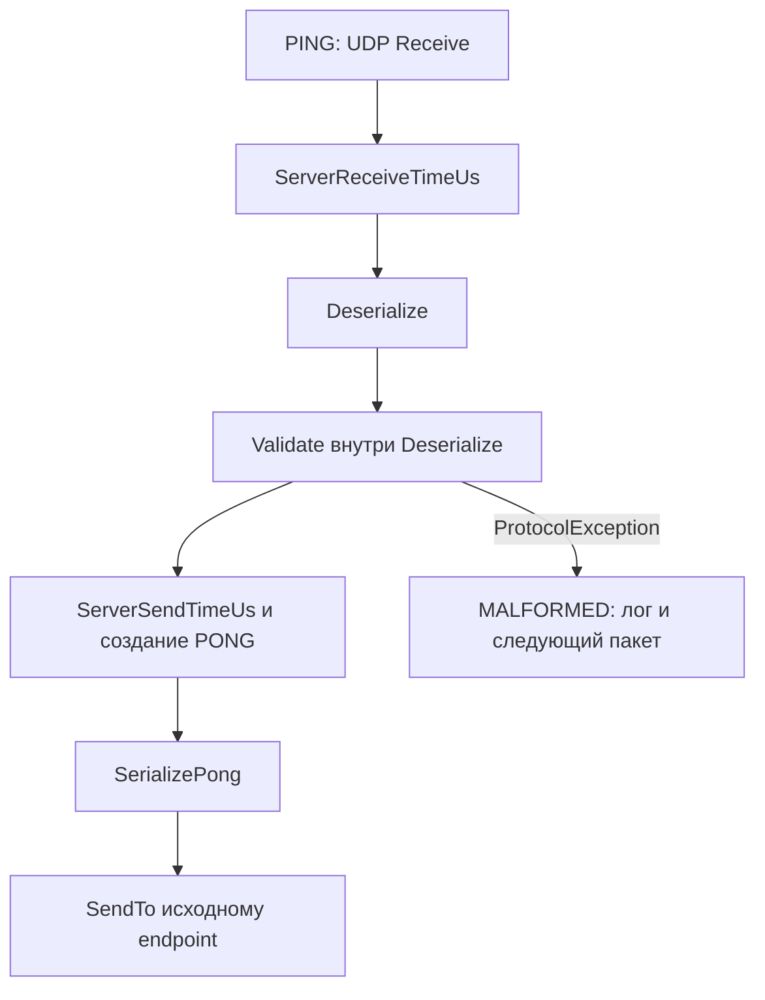
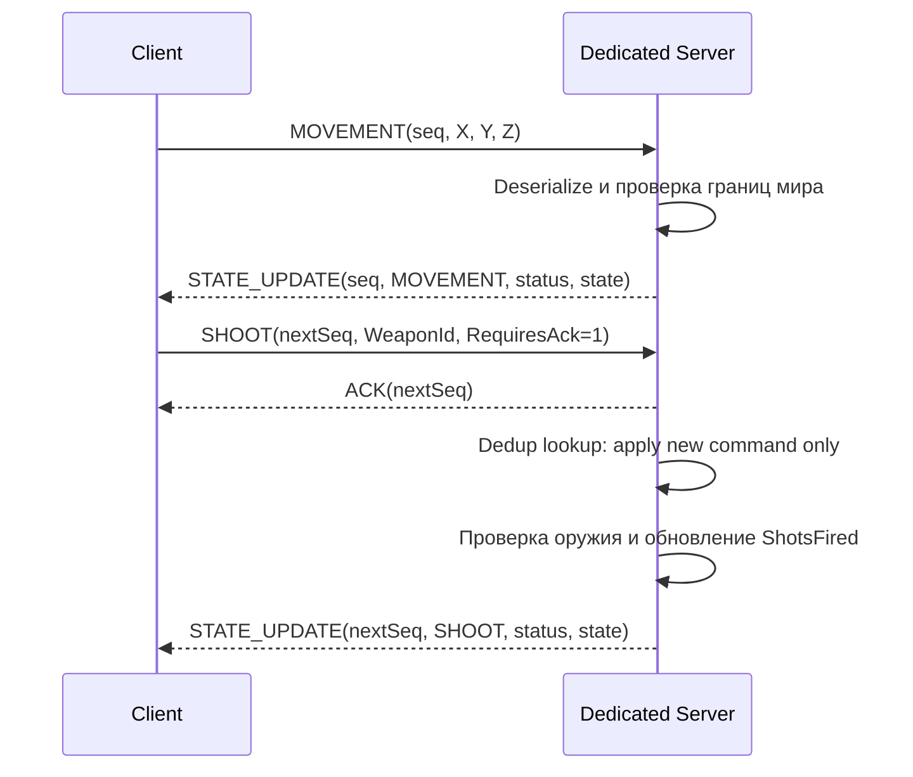
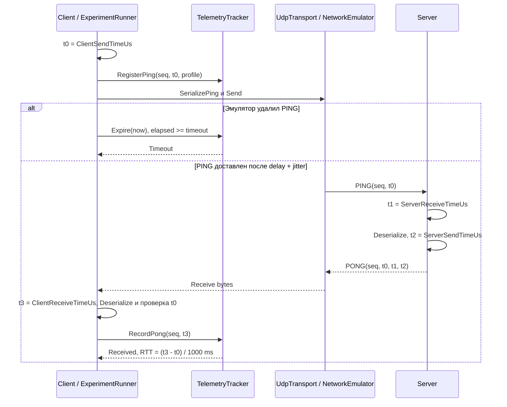
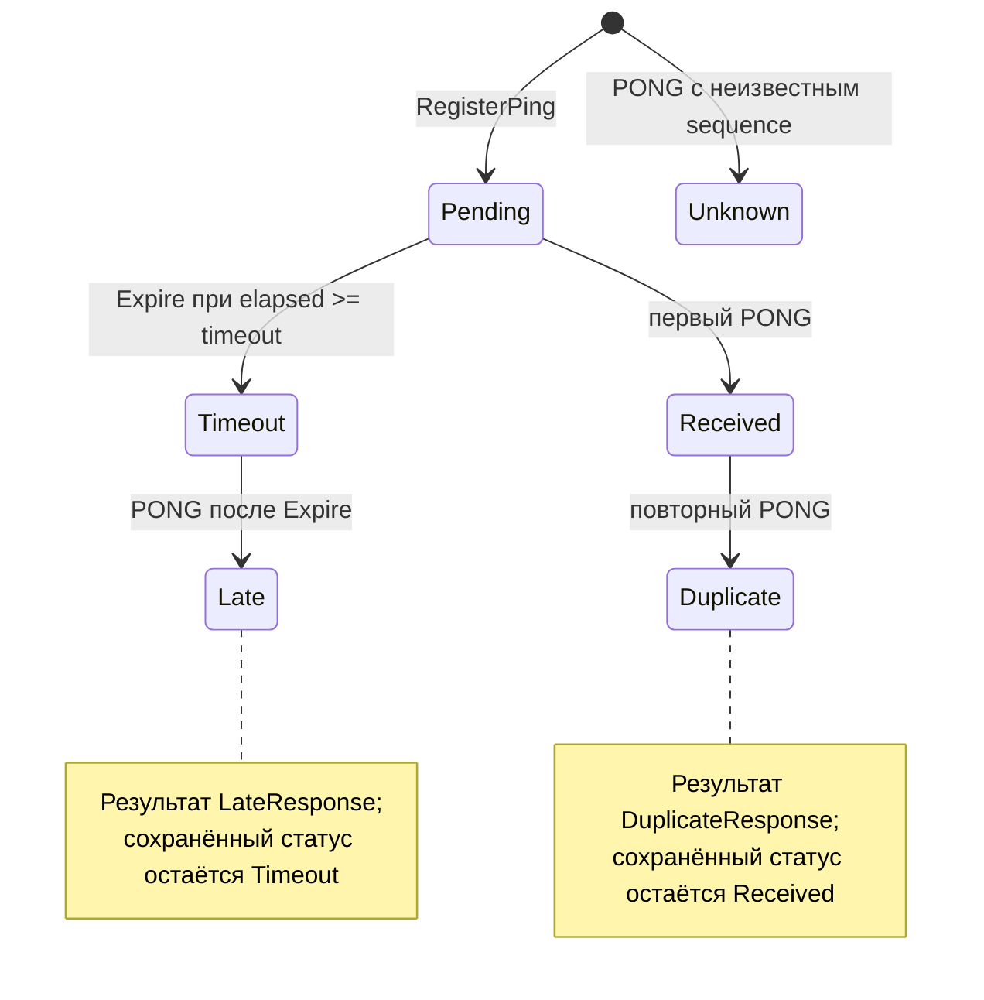
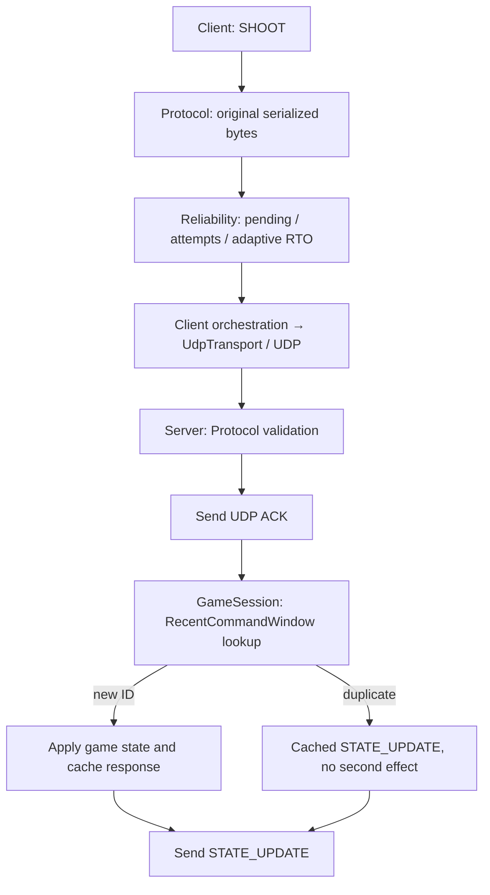

# Architecture Design

## 1. Назначение системы

Проект на C# / .NET 10 моделирует UDP-обмен клиента с authoritative Dedicated Server и измеряет влияние сетевых условий на задержку и потери. Сервер хранит игровое состояние, клиент отправляет команды. Экспериментальный режим собирает телеметрию без изменения игрового состояния.

Это консольный учебный прототип. Источники описания — [исходные проекты](../src), [тесты](../tests) и [CSV](latency_samples.csv). Байтовый формат описан в [Protocol Specification](Protocol_Specification.md), результаты — в [Latency Report](Latency_Report.md).

## 2. Развитие архитектуры

### Практическая работа №1

UdpGame.Protocol задаёт MOVEMENT, SHOOT и STATE_UPDATE. UdpGame.Client отправляет движение и выстрел, UdpGame.Server проверяет команду и возвращает своё состояние. Авторитетность означает, что именно сервер решает, принять ли координаты или оружие.

### Практическая работа №2

Добавлены UdpGame.Transport, UdpGame.Telemetry, PING/PONG, Network Emulator и режим --experiment. Игровой сценарий сохранён. Header ПР №2 всех пяти типов содержит ProtocolVersion; сохранение сценария не означает побайтовую совместимость с прежним заголовком без версии.

| Аспект | ПР №1 | ПР №2 — развитие |
|---|---|---|
| Сценарий | Игровая команда → состояние | Дополнительно PING → PONG → измерение |
| Проекты | Protocol, Client, Server | Дополнительно Transport и Telemetry |
| Пакеты | MOVEMENT, SHOOT, STATE_UPDATE | Дополнительно PING, PONG |
| UDP | Базовый обмен | Сервер и эксперимент используют UdpTransport |
| Клиент | Демонстрация команд | Дополнительно шесть экспериментальных серий |
| Контроль | STATE_UPDATE и SequenceNumber | inFlight, RTT, SRTT, jitter, timeout, loss |
| Артефакты | Демонстрация и снимки консоли | CSV, шесть графиков в charts/, аналитический отчёт и разбор визуализаций |

### Практическая работа №3

Добавлены ACK/RequiresAck wire v2, reliable SHOOT, ClientDeliveryTracker, общий UDP retransmission loop и bounded server deduplication. Отдельный эксперимент --reliability-experiment измеряет подтверждение доставки при потерях запросов и ACK; реальный CSV и графики сохранены. MOVEMENT и прежний режим ПР №2 продолжают работать. Подробная цепочка ответственности приведена в разделе 14.

## 3. Общая архитектура

Сплошные стрелки показывают передачу данных; пунктир — использование компонента. NetworkEmulator находится в проекте Transport. Обычный клиент теперь использует UdpTransport без эмуляции; reliability loop общий с ПР №3.

Фактические ProjectReference:

| Проект | Прямые зависимости на проекты solution |
|---|---|
| UdpGame.Client | UdpGame.Protocol, UdpGame.Transport, UdpGame.Telemetry, UdpGame.Reliability |
| UdpGame.Server | UdpGame.Protocol, UdpGame.Transport |
| UdpGame.Protocol | Нет |
| UdpGame.Transport | Нет |
| UdpGame.Telemetry | Нет |
| UdpGame.Reliability | Нет |
| UdpGame.Reliability.Tests | UdpGame.Reliability |
| UdpGame.Protocol.Tests | UdpGame.Protocol |
| UdpGame.Telemetry.Tests | UdpGame.Telemetry |
| UdpGame.Integration.Tests | UdpGame.Client, UdpGame.Server (transitive library dependencies) |

Transport получает сериализованные байты и не зависит от Protocol. Telemetry не зависит от Protocol или Transport. Все десять проектов используют net10.0; тестовые проекты подключают MSTest 4.0.2.

## 4. UdpGame.Protocol

Packet объединяет PacketHeader и объект payload. Header содержит PacketType, SequenceNumber, PayloadSize, ProtocolVersion и RequiresAck. PacketType определяет шесть допустимых сообщений; payload представлены record struct Movement, Shoot, StateUpdate, Ping, Pong, AckPayload.

ProtocolSerializer явно записывает поля в big-endian, а не копирует память C#-объектов. При чтении проверяются длина, тип, версия, размер payload и значения отдельных полей. ProtocolConstants задаёт header 8 байт, версию 2 и MaxPacketSize = 1024. ProtocolException сигнализирует об ошибке wire format. Ограничения мира и оружия принадлежат серверу, а не сериализатору.

## 5. UdpGame.Transport

UdpTransport оборачивает UdpClient. Connect создаёт клиентский сокет и при наличии профиля — эмулятор. Bind создаёт серверный сокет без эмулятора. Receive возвращает дейтаграмму и endpoint отправителя; SendTo отвечает конкретному клиенту.

Клиентский Send копирует байты и запрашивает NetworkEmulator.Next(). При удалении возвращает false. Без задержки отправляет сразу; при положительной задержке Task.Run и Task.Delay откладывают отправку, не блокируя цикл эксперимента. Отправки защищены lock; Dispose ожидает отложенные задачи и закрывает сокет.

В ПР №2 эмулятор действует только на исходящие PING экспериментального клиента; его прежние профили и seeds сохранены. В ПР №3 тот же NetworkEmulator применяется к отправке и приёму всех дейтаграмм клиента, включая SHOOT и ACK. Receive delay планируется priority queue, не блокируя client polling до срока пакета. Он проверяет вероятность loss, выбирает целочисленный jitter во включительном диапазоне и возвращает BaseDelayMs + jitter. PONG идёт без эмуляции. Поэтому +50 ms добавляет примерно 50 ms к RTT, а не 100 ms.

Для каждой серии создаётся новый Random с seed 20260923. Это воспроизводит решения при том же профиле и порядке вызовов, но не время планирования ОС. В combined генератор расходуется и на loss, и на jitter, поэтому удаления не обязаны совпадать с loss_5. Полная таблица — в [Experiment Config](Experiment_Config.md).

## 6. UdpGame.Telemetry

TelemetryTracker хранит словарь измерений по UInt16 SequenceNumber и очередь порядка добавления. InFlightMeasurement содержит SendTimeUs, ExperimentId, Status, Attempts, RTT и SRTT. В эксперименте Attempts = 1: повторных отправок нет.

Ёмкость inFlight по умолчанию 1024, в ExperimentRunner — 128 на серию. При заполнении удаляются старейшие завершённые записи. Если старейшая запись Pending, новая регистрация вызывает ошибку: ожидающая запись не теряется. Повторно зарегистрировать номер, пока он есть в словаре, нельзя. Счётчики и список успешных RTT сохраняются независимо от вытеснения записей.

RegisterPing увеличивает sent до решения эмулятора: удалённый PING тоже считается попыткой. Первый RecordPong для Pending вычисляет (receiveUs − sendUs) / 1000, обновляет SRTT с коэффициентом 0.125 и jitter — среднее абсолютных разностей последовательных успешных RTT. GetStatistics возвращает sent, received, timeout, min/max/mean/median RTT, текущий SRTT, jitter и долю timeout от sent.

Expire(nowUs) переводит Pending в Timeout при nowUs − SendTimeUs >= timeoutUs. RecordPong сам дедлайн не проверяет: он смотрит на сохранённый статус. В цикле клиента Expire вызывается перед очередной отправкой/приёмом, поэтому обнаружение timeout дискретно. Ожидание сокета 1–20 ms — механизм опроса, отдельный от timeout измерения 1000 ms.

## 7. UdpGame.Server

Сервер слушает порт 27015 по умолчанию, хранит ClientState по строке endpoint. MOVEMENT принимает только конечные координаты в [-1000; 1000] и меняет позицию. SHOOT принимает WeaponId 1–3; GameSession отправляет ACK на RequiresAck и проверяет RecentCommandWindow до увеличения ShotsFired и обновления LastWeaponId. Для duplicate возвращается прежний STATE_UPDATE без эффекта. Отказ даёт OUT_OF_RANGE и прежнее состояние в STATE_UPDATE.

PING обрабатывается до поиска игрового состояния: не создаёт ClientState и не меняет игру. Сервер возвращает номер и клиентскую метку запроса. ServerReceiveTimeUs снимается после Receive, ServerSendTimeUs — до сериализации PONG, а не в момент физического выхода пакета в сеть.

Входящие STATE_UPDATE/PONG отвергаются как server-only. Обработанные игровые команды (включая duplicate) и PING увеличивают счётчик --max-packets; malformed и server-only — не увеличивают.

## 8. UdpGame.Client

Обычный режим чередует ненадёжный MOVEMENT и reliable SHOOT. MOVEMENT ждёт STATE_UPDATE; SHOOT использует общий ReliableShootSender: ACK с повторами исходных bytes плюс STATE_UPDATE. По умолчанию: 6 команд, пауза между командами 500 ms, ожидание состояния 2000 ms, socket polling 20 ms. RTO адаптивный, не равен state timeout. Thread.Sleep выполняется между командами после ожидания ответа, поэтому interval здесь не строгий период отправки.

Режим --experiment запускает ExperimentRunner: шесть профилей по 50 PING с плановым периодом 200 ms. На серию создаются новые transport, tracker, словарь sample и множество completed. SequenceNumber сквозной: 1–300. Серия завершается после отправки 50 PING и завершения всех Pending.

Клиент проверяет ClientSendTimeUs в PONG по inFlight и игнорирует несовпадение. Только первый Received добавляет успешную CSV-строку; Expire добавляет timeout. completed исключает повторную строку для того же sequence. Все строки сортируются по SequenceNumber и записываются в конце эксперимента.

В experiment mode --count, --interval-ms, --timeout-ms не задают параметры серий: используются константы ExperimentRunner. Применяются --host, --port, --csv. Планирование привязано к старту серии, но фактические времена зависят от выполнения цикла.

## 9. Обычный игровой обмен

Снимки реального обмена сохранены в [демонстрации ПР №1](Демонстрация_работы_протокола.md).

## 10. Telemetry exchange

Метки выражены в микросекундах. RTT включает задержку эмулятора, обработку сервера и обратную доставку. t0/t3 получены по монотонным часам клиента; t1/t2 не участвуют в RTT. Синхронизация часов не требуется.

## 11. inFlight state machine

| Обозначение | Смысл | Влияние на статистику |
|---|---|---|
| Pending | PING зарегистрирован, исход ещё не определён | Sent уже увеличен |
| Received | Первый PONG для Pending принят | Received +1, обновляются RTT/SRTT/jitter |
| Timeout | Expire обнаружил истечение ожидания | Timeout +1; RTT отсутствует |
| Late | PONG для записи Timeout | LateResponse; timeout не отменяется |
| Duplicate | PONG для записи Received | DuplicateResponse; метрики не повторяются |
| Unknown | SequenceNumber отсутствует в словаре | UnknownResponse; запись не создаётся |

В MeasurementStatus существуют только Pending, Received, Timeout. Late, Duplicate и Unknown — результаты обработки PONG, не дополнительные хранимые состояния. Unknown возможен и после вытеснения старой записи. Timeout-строка сохраняет текущий SRTT, но не обновляет его.

## 12. Обработка ошибок

| Ситуация | Где обнаруживается | Результат |
|---|---|---|
| Менее 8 байт, truncated packet | Deserialize: длина header/payload | ProtocolException |
| Более MaxPacketSize = 1024 байт | Deserialize до чтения полей | ProtocolException |
| Invalid PacketType | DecodePacketType | ProtocolException |
| Invalid ProtocolVersion: не 2 | Deserialize | ProtocolException |
| Invalid PayloadSize: не совпадает с длиной или типом | Deserialize / RequirePayloadSize | ProtocolException |
| NaN/Infinity, неверный enum ответа | ReadMovement / ReadStateUpdate | ProtocolException |

Сервер ловит ProtocolException внутри цикла, пишет MALFORMED и продолжает приём. ExperimentRunner игнорирует malformed-ответы и короткие socket timeout. Обычный клиент и reliability runner также игнорируют malformed-ответы в receive loop. Failed delivery не бросает exception: логируется и возвращается результат failed; обычный сценарий продолжает остальные команды. Прочие сетевые ошибки вне специальных обработчиков также могут завершить процесс; устойчивость к malformed datagrams не означает перехват всех возможных ошибок.

В исходниках 78 тестовых методов: 21 в Protocol.Tests, 10 в Telemetry.Tests, 27 в Reliability.Tests, 20 в Integration.Tests. Новые тесты проверяют ACK/RequiresAck, retransmission, maxAttempts, failed, Karn-метаданные и AdaptiveTimeout. Они проверяют wire format, round-trip, UInt16/UInt64 big-endian, неверные размеры/версию/тип, RTT/SRTT/jitter/loss/median и классификацию PONG. Integration.Tests отдельно проверяют реальные UDP-сокеты, первую потерю ACK, incoming loss/delay и production client/server обработчики.

## 13. Почему модули разделены

Protocol определяет смысл байтов, Transport передаёт байты, Telemetry оценивает результаты. Эмулятор изменяет доставку, но не формат PING. Статистика не зависит от открытия сокетов: тесты Telemetry задают время без сети.

Client связывает компоненты в сценарий, выбирает профили, проверяет PONG и экспортирует CSV. Перенос CLI/CSV в Telemetry связал бы расчёты с конкретной демонстрацией. Библиотеки не зависят от Unity и допускают дальнейшее подключение к игровому клиенту; такого подключения сейчас нет.

## 14. ПР №3: надёжность

ClientDeliveryTracker связывает независимые библиотеки ReliableChannel, AdaptiveTimeout и TelemetryTracker на уровне приложения. ReliableShootSender выполняет реальную отправку, polling, ACK handling, retries и failed handling; это общий путь обычного клиента и ReliabilityExperimentRunner. UdpGame.Reliability не выполняет network IO и не зависит от Protocol/Transport/Telemetry.

Граф показывает логические обязанности, не самостоятельный сетевой pipeline внутри Reliability: Client сериализует SHOOT один раз, отправляет и регистрирует первоначальную попытку; при RTO выбирает и отправляет сохранённые bytes. ACK снимает pending по AcknowledgedSequence. ACK sample допустим только при Attempts=1, а successful PING/PONG samples подаются в AdaptiveTimeout через Client.

RecentCommandWindow — bounded Dictionary + Queue на 1024 ответа каждого endpoint. Он сравнивает IDs по равенству и работает при 65535 → 0; после вытеснения ID защита от старого duplicate прекращается. Сам ACK не является durable commit и не гарантирует глобальное exactly-once.

ReliabilityExperimentRunner запускает отдельный --reliability-experiment: 6×50 SHOOT, один probe перед каждой командой, 50 ms quiet interval, два независимых seed 20261009/20261010 и двусторонняя эмуляция. STATE_UPDATE остаётся ненадёжным. Существующий --experiment ПР №2 сохраняет CSV и fixed timeout; его successful RTT также поступают в локальный AdaptiveTimeout, не меняющий параметры этого эксперимента.

Фактический запуск: 300 исходных команд, 299 подтверждены, 59 retransmissions, 1 failed; 29 server duplicates без повторного применения. Полные параметры, CSV, графики, Karn и ограничения late ACK/session lifecycle — в [Reliability Protocol](Reliability_Protocol.md).
