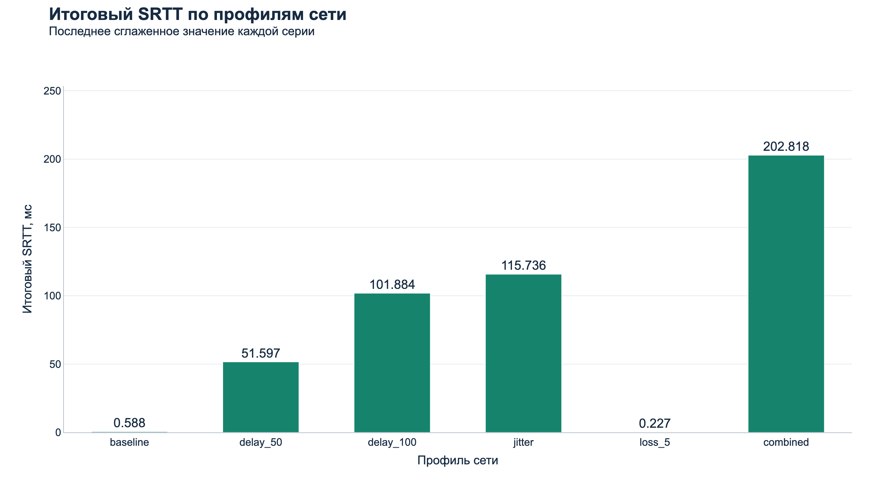
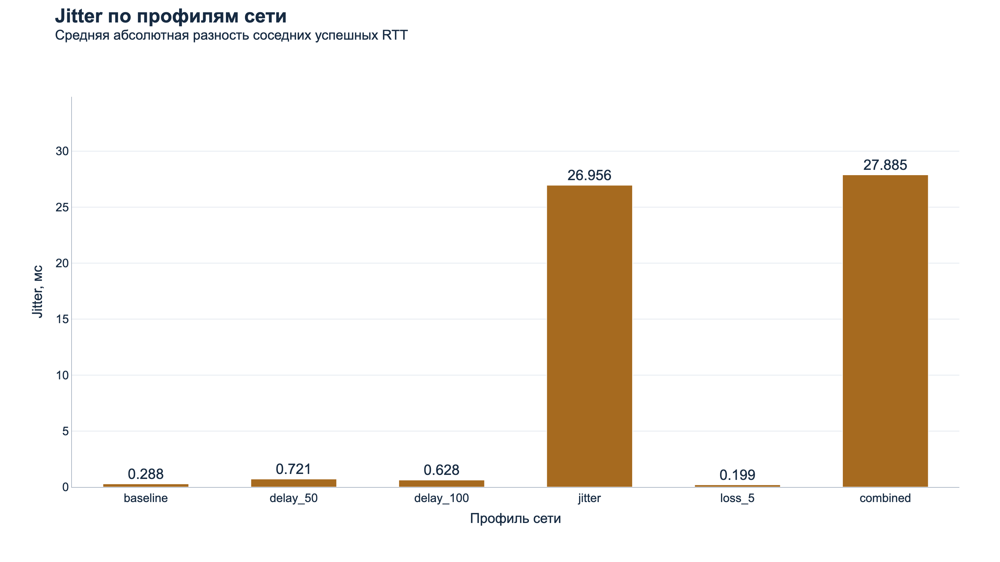

# Анализ графиков сетевой телеметрии

Документ помогает последовательно объяснить визуализации на защите ПР №2. Общая методика и итоговая статистика находятся в [Latency Report](Latency_Report.md), настройки эмулятора — в [Experiment Config](Experiment_Config.md). Здесь основной акцент — как читать каждый график и какие выводы подтверждают данные.

| № | Визуализация | Файл | Что анализируем |
|---|---|---|---|
| 1–6 | Динамика RTT | [папка rtt](charts/rtt/) | Шесть отдельных серий по 50 измерений |
| 7 | Средний RTT | [chart_mean_rtt.png](charts/chart_mean_rtt.png) | Среднюю задержку |
| 8 | SRTT | [chart_srtt.png](charts/chart_srtt.png) | Сглаженную задержку |
| 9 | Jitter | [chart_jitter.png](charts/chart_jitter.png) | Стабильность задержки |
| 10 | Потери пакетов | [chart_packet_loss.png](charts/chart_packet_loss.png) | Долю тайм-аутов |
| 11 | Распределение RTT | [chart_rtt_distribution.png](charts/chart_rtt_distribution.png) | Разброс значений RTT |

## 1. Исходные данные

Источник — [latency_samples.csv](latency_samples.csv), сохранённые результаты реального проведённого эксперимента. Графики построены по его строкам, без искусственно созданных измерений, подмены результатов или повторного запуска клиента. В наборе шесть профилей: baseline, delay_50, delay_100, jitter, loss_5, combined; каждый содержит 50 измерений, всего 300.

| Поле CSV | Использование |
|---|---|
| experiment_id | Группировка по сетевому профилю |
| sample | Номер 1–50 на оси X графика динамики |
| sequence | Проверка уникальности и порядка 300 попыток, поиск timeout |
| sent_at_ms | Проверка порядка получения через sent_at_ms + rtt_ms |
| rtt_ms | Линии RTT, mean, jitter, квартильные распределения, восстановление SRTT |
| srtt_ms | Проверка восстановленного SRTT, включая итоговое значение серии |
| status | Разделение received и timeout; вычисление потерь |

Успешных ответов 295, timeout — 5. Пустой rtt_ms в timeout-строке означает отсутствие измеренного RTT, а не нулевую задержку. Такие строки учитываются в sent и loss, но исключаются из mean RTT, jitter и box plot.

Метрики пересчитаны независимо. Успешные ответы в данном CSV идут в том же порядке по sequence и по оценке момента получения sent_at_ms + rtt_ms; это важно для SRTT и jitter. Значения показываются до трёх десятичных знаков, проценты — до двух. При точной половине округление выполняется вверх; например, 0.2155 ms → 0.216 ms.

Все 11 PNG построены через Plotly и экспортированы Kaleido. Белый фон, крупные подписи и единая палитра предназначены для PDF и проектора. Шкалы задержки выражены в миллисекундах, потерь — отдельно в процентах.

## 2. Динамика RTT по измерениям

### baseline


RTT лежит в диапазоне 0.135–5.559 мс, среднее — 0.453 мс; тайм-аутов нет. Основная группа значений ниже миллисекунды, но отдельные пики поднимают среднее.

Что сказать преподавателю: «Baseline задаёт точку сравнения: все 50 ответов получены, а задержка в основном минимальна».

### delay_50


RTT — 50.444–55.110 мс, среднее — 51.873 мс; тайм-аутов нет. Линия держится около постоянного уровня: фиксированная задержка сдвинула RTT, не создав больших колебаний.

Что сказать преподавателю: «Профиль delay_50 поднимает средний RTT примерно на заданную одностороннюю задержку».

### delay_100


RTT — 100.263–102.505 мс, среднее — 101.880 мс; тайм-аутов нет. По сравнению с delay_50 уровень выше примерно ещё на 50 мс, а разброс остаётся небольшим.

Что сказать преподавателю: «Постоянная задержка меняет уровень RTT, но сама по себе не означает потери или сильный Jitter».

### jitter


RTT — 52.833–152.314 мс, среднее — 114.355 мс; тайм-аутов нет. Частые скачки между соседними измерениями показывают нестабильность, которую одно среднее значение не описывает.

Что сказать преподавателю: «Профиль jitter наглядно показывает, что средний RTT и изменчивость задержки — разные характеристики».

### loss_5


Успешные RTT — 0.134–3.587 мс, среднее — 0.295 мс. На измерениях 5 и 33 отмечены два тайм-аута; линия RTT там разорвана, поскольку RTT не измерен.

Что сказать преподавателю: «Тайм-аут показан отдельным красным маркером: это не RTT 1000 мс, а отсутствующее измерение».

### combined


Успешные RTT — 150.956–251.105 мс, среднее — 208.063 мс. На измерениях 3, 17 и 47 есть три тайм-аута; профиль одновременно показывает высокий уровень, сильные колебания и потери.

Что сказать преподавателю: «Combined — самый тяжёлый сценарий в этой выборке: он сочетает наибольший средний RTT, высокий Jitter и три тайм-аута».

## 3. Средний RTT по профилям сети


### Что показывает

Столбцы сравнивают среднее время успешного обмена в шести условиях. Значения подписаны над столбцами: малые baseline и loss_5 остаются читаемыми рядом с большим combined.

### Ось X

Название сетевого профиля в порядке проведения серий. Это категории, а не числовая шкала.

### Ось Y

Средний RTT, мс, на общей линейной шкале с нуля. Потерь в процентах на этой оси нет.

### Как рассчитано значение

Средний RTT = сумма rtt_ms успешных ответов / Received. Знаменатель равен 50 для первых четырёх серий, 48 для loss_5 и 47 для combined. Тайм-ауты не подставляются ни как ноль, ни как 1000 ms.

### Анализ результатов

| Профиль | Средний RTT, мс |
|---|---:|
| baseline | 0.453 |
| delay_50 | 51.873 |
| delay_100 | 101.880 |
| jitter | 114.355 |
| loss_5 | 0.295 |
| combined | 208.063 |

Относительно baseline среднее delay_50 выросло на 51.420 ms, delay_100 — на 101.427 ms. Между delay_50 и delay_100 разница 50.007 ms. Это согласуется с эмуляцией задержки только исходящего PING, без удвоения на обратном пути.

Среднее combined наибольшее. Малое среднее loss_5 не означает улучшение сети: два отсутствующих ответа исключены из RTT. Среднее также не показывает разброс — для этого нужны динамика, jitter и распределение.

### Вывод

График позволяет быстро сравнить среднюю задержку успешных ответов. Для оценки качества обмена его нужно читать вместе с графиком потерь: быстро отвечающие пакеты не компенсируют исчезнувшие попытки.

### Что сказать преподавателю

«Среднее рассчитано только по полученным ответам. При +50 и +100 миллисекундах исходящей задержки оно возрастает примерно на соответствующую величину. У loss_5 среднее низкое, но этот профиль нельзя назвать лучшим без учёта двух timeout».

## 4. SRTT по профилям сети



### Что показывает

По X расположены профили, по Y — Final SRTT в миллисекундах. Каждый столбец показывает последнее сглаженное значение серии, а не среднее всех SRTT и не отдельный последний RTT. При переходе к следующему профилю tracker создаётся заново.

### Как рассчитывается SRTT

Первый полученный RTT задаёт SRTT. Затем для каждого успешного ответа:

```text
SRTT = 0.875 × previous SRTT + 0.125 × RTT
```

Новый RTT получает вес 12.5%, а предыдущая оценка — 87.5%. Поэтому единичный скачок не переносится в оценку целиком, но последовательное изменение задержки постепенно меняет SRTT. Timeout, Late и Duplicate не обновляют сглаживание.

SRTT независимо восстановлен по rtt_ms; промежуточные значения сверены со srtt_ms с учётом округления CSV, итоговые совпали до трёх знаков. В отличие от арифметического mean, SRTT зависит от порядка ответов и сильнее учитывает конец серии.

### Анализ результатов

| Профиль | Final SRTT, мс | Mean RTT для сравнения, мс |
|---|---:|---:|
| baseline | 0.588 | 0.453 |
| delay_50 | 51.597 | 51.873 |
| delay_100 | 101.884 | 101.880 |
| jitter | 115.736 | 114.355 |
| loss_5 | 0.227 | 0.295 |
| combined | 202.818 | 208.063 |

У delay_100 итоговый SRTT близок к общему среднему, что согласуется с устойчивым уровнем задержки. У combined SRTT ниже mean, потому что веса у наблюдений разные. Это не потеря точности расчёта и не доказательство устранения jitter: сглаживается оценка, а не сама доставка.

### Вывод

Сравнение SRTT показывает сглаженный уровень задержки к концу каждого профиля. Он может служить основой для будущего выбора времени ожидания, но текущий код использует фиксированный timeout 1000 ms. Сам столбчатый график конечных значений не демонстрирует всю траекторию сглаживания.

### Что сказать преподавателю

«SRTT — сглаженная оценка: новый RTT даёт только одну восьмую следующего значения. Здесь показано последнее значение каждой серии, поэтому оно может отличаться от среднего RTT. Эта оценка полезна для дальнейшей работы с timeout, но адаптивный timeout сейчас не реализован».

## 5. Jitter по профилям сети



### Что показывает

По X — профиль, по Y — измеренный jitter в миллисекундах. Он отвечает на вопрос, насколько меняется задержка от одного успешного ответа к следующему, а не насколько долго пакет идёт в среднем.

### Как рассчитывается

```text
Jitter = сумма |RTT_i − RTT_(i−1)| / (Received − 1)
```

Берутся соседние успешные RTT в порядке обработки. Если между ними была timeout-попытка, она пропускается. При менее двух успешных измерениях код возвращает 0; в наших сериях успешных измерений от 47 до 50.

Не следует путать рассчитанную метрику с настройкой эмулятора JitterMinMs/JitterMaxMs. Настройка задаёт случайную добавку к отправке, а метрика описывает изменения фактически полученных RTT. Это также не стандартное отклонение и не max − min.

### Анализ результатов

| Профиль | Jitter, мс |
|---|---:|
| baseline | 0.288 |
| delay_50 | 0.721 |
| delay_100 | 0.628 |
| jitter | 26.956 |
| loss_5 | 0.199 |
| combined | 27.885 |

У delay_100 высокий mean RTT 101.880 ms, но jitter всего 0.628 ms: ответы медленные, однако сравнительно стабильные. В профиле jitter среднее 114.355 ms сопоставимо по масштабу, но изменения между соседними ответами намного больше — 26.956 ms. Combined даёт наибольший jitter в этой выборке.

Низкие 0.199 ms у loss_5 описывают только полученные ответы. Показатель не штрафует серию за timeout, поэтому для оценки потерь требуется отдельная визуализация.

### Вывод

Высокий RTT и высокий jitter характеризуют разные проблемы: длительность ожидания и её непостоянство. Постоянный delay может заметно увеличить RTT, сохранив низкий jitter. Измеренная стабильность не гарантирует полноту доставки.

### Что сказать преподавателю

«Jitter здесь — среднее абсолютное изменение соседних успешных RTT. У delay_100 задержка высокая, но достаточно ровная; у jitter и combined она сильно скачет. Поэтому для сетевого поведения важно знать не только среднее время ответа».

## 6. Потери пакетов


### Что показывает

По X — профили; по Y — Loss Rate в процентах, отдельная от миллисекунд шкала. Подписи показывают и проценты, и количество timeout из 50 попыток. В текущей реализации это доля не завершившихся вовремя измерений, а не прямое измерение физического удаления на конкретном участке сети.

### Как рассчитывается

```text
Loss Rate = Timeout / Sent × 100%
```

Sent включает все зарегистрированные PING, в том числе удалённые эмулятором. Timeout берётся из status CSV. После Expire поздний PONG не отменяет timeout и не превращает строку в received.

### Анализ результатов

| Профиль | Sent | Received | Timeout | Loss Rate |
|---|---:|---:|---:|---:|
| baseline | 50 | 50 | 0 | 0.00% |
| delay_50 | 50 | 50 | 0 | 0.00% |
| delay_100 | 50 | 50 | 0 | 0.00% |
| jitter | 50 | 50 | 0 | 0.00% |
| loss_5 | 50 | 48 | 2 | 4.00% |
| combined | 50 | 47 | 3 | 6.00% |

У loss_5 timeout соответствуют sample 5 и 33 (sequence 205, 233). У combined — sample 3, 17, 47 (sequence 253, 267, 297). В остальных профилях потерянных по критерию tracker ответов нет; это наблюдение данной серии, а не гарантия для любого запуска.

В коде loss-профили намеренно удаляют часть PING. Это согласуется с результатом, но CSV не содержит журнал решений эмулятора, поэтому причину каждого timeout из него установить нельзя. Порог timeout равен 1000 ms; проверки Expire дискретны, а RecordPong сам время с дедлайном не сравнивает.

### Почему фактические потери отличаются от заданной вероятности

Вероятность 5% применяется к каждой попытке и не задаёт фиксированную квоту. При 50 попытках число timeout целое, а доля меняется с шагом 2 процентных пункта. Ровно 5% означало бы 2.5 пакета, поэтому результат одной такой серии не может быть ровно 5%.

Seed 20260923 фиксирует псевдослучайные решения при одинаковом ходе вычислений. В combined есть дополнительные вызовы Random для jitter, поэтому совпадающий seed не требует одинаковых удалений с loss_5. Фактические 4% и 6% не противоречат настройке 5%.

### Вывод

Потери нужно учитывать отдельно от задержки: профиль может иметь быстрые успешные ответы и всё же терять попытки. В данной выборке combined дал больше timeout, чем loss_5. Этот результат не означает, что его настроенная вероятность удаления больше: у обоих она равна 5%.

### Что сказать преподавателю

«Столбцы показывают долю timeout: два из пятидесяти — 4%, три из пятидесяти — 6%. Настройка 5% — вероятность отдельного решения, а не обязательный процент в короткой серии. У остальных профилей в сохранённом CSV все ответы получены».

## 7. Распределение RTT


### Что показывает

Единый Box Plot сравнивает все шесть профилей: по X — профиль сети, по Y — RTT в миллисекундах на общей линейной шкале. Малые коробки baseline и loss_5 прижаты к нулю из-за общего масштаба. Тайм-ауты не участвуют в распределении.

### Как читать Box Plot

- **Медиана** — середина упорядоченной выборки: примерно половина RTT ниже неё, половина выше. Она показана линией внутри коробки и подписана сверху.
- **Q1** — нижняя граница коробки, около 25% наблюдений лежат не выше неё.
- **Q3** — верхняя граница коробки, около 75% наблюдений лежат не выше неё. Между Q1 и Q3 расположена центральная половина выборки.
- **IQR = Q3 − Q1** — высота коробки, то есть разброс этой центральной половины.
- **Whiskers, или усы** — линии до крайних реальных наблюдений, остающихся в пределах Q1 − 1.5 × IQR и Q3 + 1.5 × IQR. Если есть выбросы, концы усов не совпадают с общими min/max.
- **Outliers, или выбросы** — реальные наблюдения за этими границами. Они показаны красными окружностями и не удаляются из статистики.

Зелёный ромб — mean. Он может быть выше медианы из-за нескольких больших RTT. Квартили рассчитаны линейной интерполяцией отсортированных значений: позиция равна (n − 1) × p, дробная позиция интерполируется между соседями. Рассчитанные Q1, median, Q3 и усы явно переданы Plotly, чтобы определение не зависело от настроек библиотеки по умолчанию.

### Анализ результатов

| Профиль | Received | Median, мс | Q1, мс | Q3, мс | Усы, мс | Выбросов |
|---|---:|---:|---:|---:|---|---:|
| baseline | 50 | 0.264 | 0.200 | 0.327 | 0.135–0.448 | 5 |
| jitter | 50 | 119.218 | 99.048 | 135.558 | 52.833–152.314 | 0 |
| combined | 47 | 214.151 | 182.858 | 232.311 | 150.956–251.105 | 0 |

У baseline IQR равен 0.127 ms, верхняя граница для определения выбросов — 0.5175 ms. За ней лежат пять RTT: 0.620, 0.849, 1.240, 3.040 и 5.559 ms. На увеличении они видны отдельно от компактной основной группы. Это статистическая характеристика, не доказательство ошибки измерения.

Коробки jitter и combined намного выше и шире, чем у baseline. Отсутствие у них выбросов по правилу 1.5 IQR не означает постоянную задержку: сами диапазоны и центральные половины выборок широки. Для combined использованы 47 успешных ответов; три timeout нужно объяснять по предыдущему графику, а не искать на box plot.

### Вывод

Box plot отделяет обычный диапазон RTT от редких больших значений и позволяет сравнить медианы и разброс. Baseline почти не виден на общей шкале по причине реальной разницы порядков задержки, поэтому вынесен в увеличение. Потери и временной порядок этим графиком не описываются.

### Что сказать преподавателю

«Линия в коробке — медиана, коробка содержит центральные 50% полученных RTT, а кружки за усами — выбросы по правилу 1.5 IQR. Baseline увеличен отдельно: его значения гораздо меньше jitter и combined. Отсутствие выбросов у combined не означает стабильность — его коробка сама по себе широкая, и три timeout исключены из распределения».
