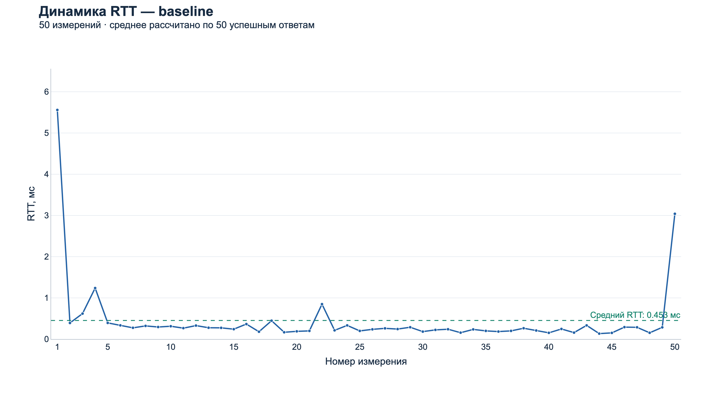
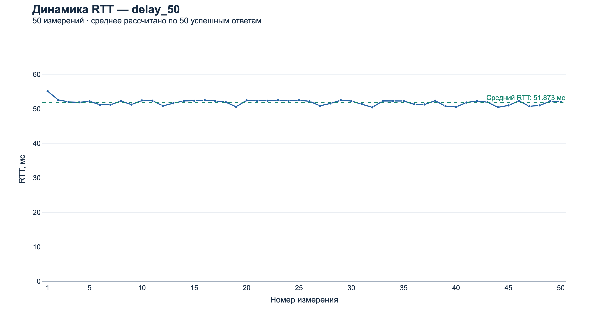
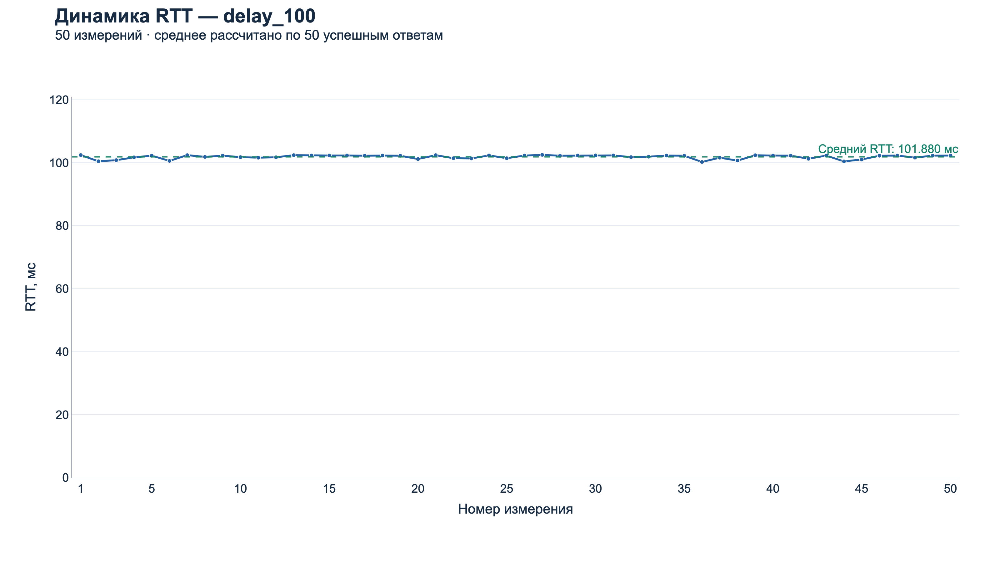
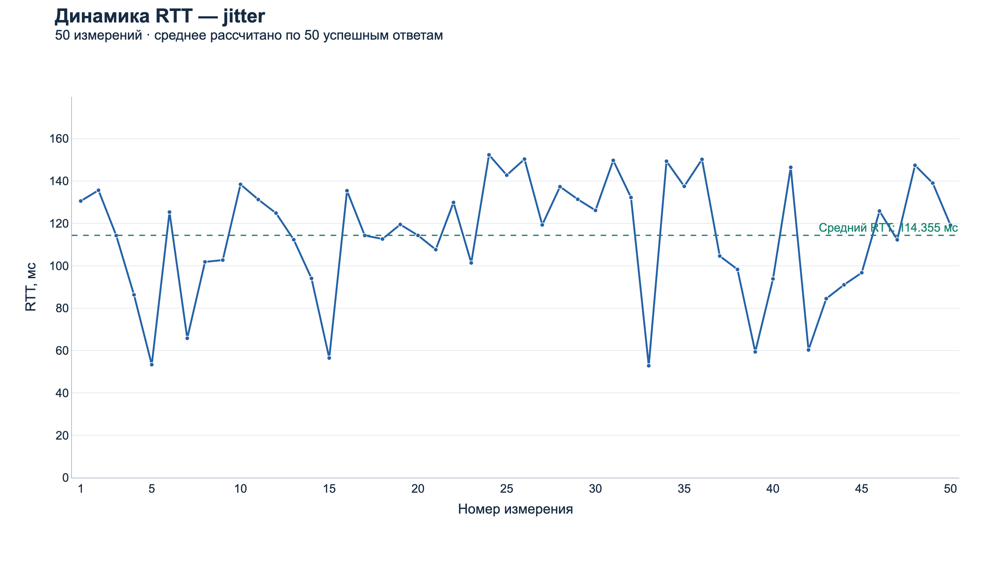
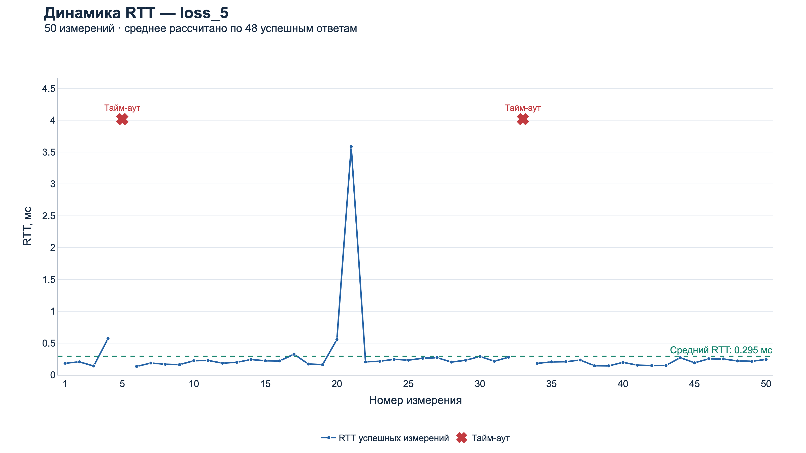
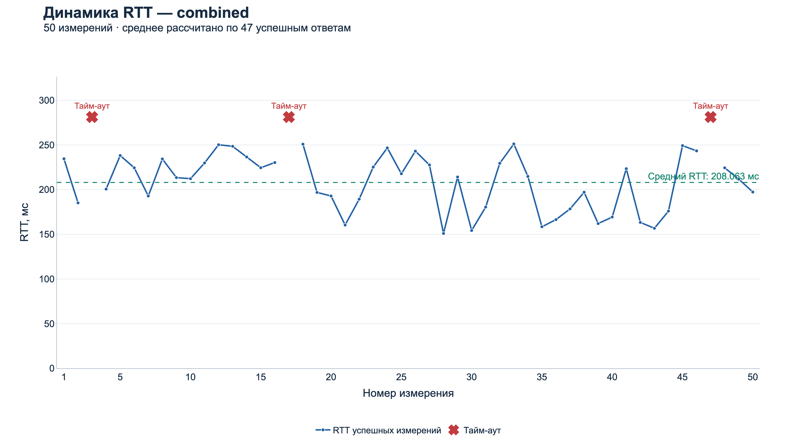
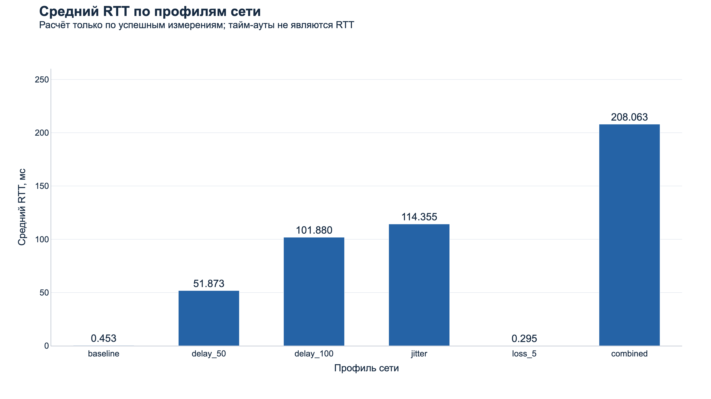
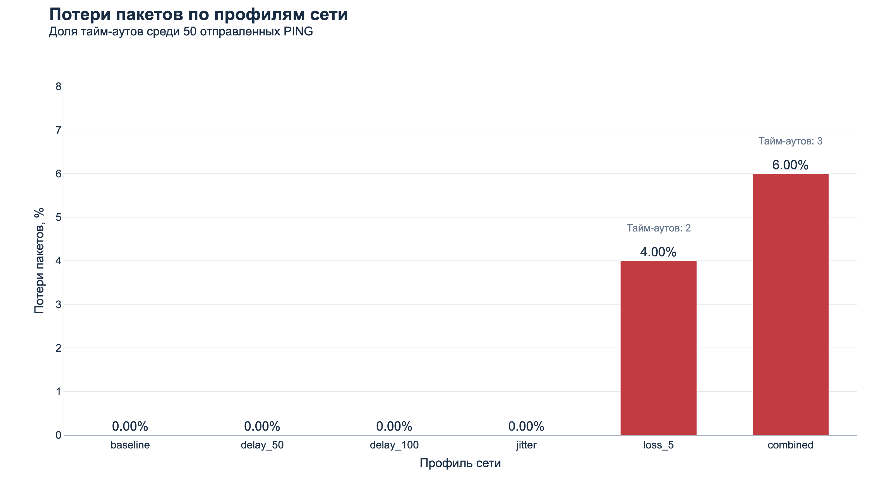
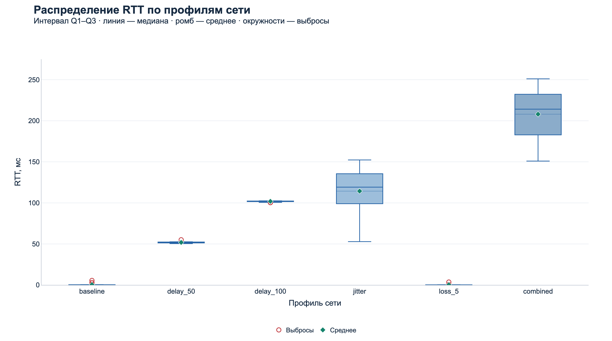

# Latency Report

## 1. Цель эксперимента

Оценить, как дополнительная задержка, случайная задержка и удаление пакетов влияют на UDP-обмен клиента с сервером. ПР №1 проверяла выполнение игровых команд; ПР №2 добавляет измерения PING/PONG, чтобы описывать качество обмена числами, а не только фактом получения ответа.

Для анализа используется существующий [latency_samples.csv](latency_samples.csv). Эксперимент при подготовке отчёта не повторялся, строки не заменялись. Все таблицы и шесть графиков Plotly получены из одного набора данных; PNG экспортированы через Kaleido в папку charts/.

## 2. Методика

В ExperimentRunner заданы шесть последовательных профилей: baseline, delay_50, delay_100, jitter, loss_5, combined. Каждый регистрирует 50 PING с плановым интервалом 200 ms и timeout 1000 ms. Seed каждого нового NetworkEmulator — 20260923; повторных отправок нет. Всего зарегистрировано 300 попыток.

Конфигурация клиента по умолчанию — localhost, 127.0.0.1:27015. CSV хранит результаты, но не адрес, порт, ОС, календарную дату и точную версию runtime исторического запуска. Поэтому локальная постановка описывается по текущему коду; неподтверждённая версия ОС из предыдущего отчёта удалена. TargetFramework всех проектов — net10.0. Подробности и границы воспроизводимости — в [Experiment Config](Experiment_Config.md).

Эмулятор действует на исходящий PING: либо удаляет его, либо отправляет после BaseDelay + jitter. Обратный PONG не эмулируется. Клиентская метка времени снимается до SerializePing и Send, так что искусственная задержка включена в RTT. Сервер сохраняет её в PONG; время получения фиксируется клиентом сразу после Receive.

Для каждой серии заново создаётся TelemetryTracker, поэтому SRTT и jitter между профилями не переносятся. CSV отсортирован по sequence; sample внутри каждого профиля идёт от 1 до 50. Проверено, что порядок успешных ответов по sent_at_ms + rtt_ms в этом CSV совпадает с порядком sequence. Это позволяет воспроизвести последовательные метрики из сохранённых строк. В общем случае UDP может переупорядочить ответы.

## 3. Метрики

**RTT** — время полного обмена по монотонным часам клиента:

```text
RTT_us = ClientReceiveTimeUs − ClientSendTimeUs
RTT_ms = RTT_us / 1000
```

Обе метки относятся к одной шкале Stopwatch. ServerReceiveTimeUs − ClientSendTimeUs не даёт RTT: часы разных сторон не обязаны быть синхронизированы, а обратный путь отсутствует в этой разности. Серверное время обработки не вычитается из измерения.

**SRTT** — экспоненциально сглаженная оценка RTT. Первое успешное измерение задаёт начальное значение; каждое следующее получает вес 0.125:

```text
SRTT_1 = RTT_1
SRTT_i = 0.875 × SRTT_(i−1) + 0.125 × RTT_i
```

Final SRTT — последнее значение серии, не среднее всех значений SRTT и не среднее RTT. Оно сильнее зависит от конца последовательности. Timeout, поздний и повторный ответы не обновляют сглаживание.

**Jitter** в этом проекте — средняя абсолютная разность соседних успешных RTT в порядке обработки ответов:

```text
Jitter = Σ |RTT_i − RTT_(i−1)| / (n_received − 1)
```

При менее двух успешных ответах код возвращает 0. Timeout пропускаются: сравниваются соседние успешные измерения, даже если между ними потеряна попытка. Это не стандартное отклонение и не диапазон случайной задержки эмулятора. Здесь термин «jitter» встречается в двух смыслах: входной случайный delay профиля и измеренная изменчивость RTT.

**Loss Rate** — доля попыток, которые tracker завершил как Timeout:

```text
Loss Rate = N_timeout / N_sent × 100%
```

Sent включает PING, удалённые эмулятором. Received включает только первый принятый ответ. RTT отсутствует при timeout: нельзя подставлять 0 или 1000 ms в среднее, медиану и box plot. Min/max/mean/median рассчитываются только по received; для чётного числа значений медиана — среднее двух центральных после сортировки.

## 4. Итоговая таблица

Пересчёт выполнен из десятичных значений CSV. RTT и SRTT записаны в CSV с точностью до 0.001 ms; в таблице используется округление до трёх знаков, при точной половине — вверх. Например, медиана loss_5 равна 0.2155 ms, после округления — 0.216 ms. Исходный CSV при этом не меняется.

| Серия | Sent | Received | Timeout | Min RTT, ms | Max RTT, ms | Mean RTT, ms | Median RTT, ms | Final SRTT, ms | Jitter, ms | Loss Rate |
|---|---:|---:|---:|---:|---:|---:|---:|---:|---:|---:|
| baseline | 50 | 50 | 0 | 0.135 | 5.559 | 0.453 | 0.264 | 0.588 | 0.288 | 0.00% |
| delay_50 | 50 | 50 | 0 | 50.444 | 55.110 | 51.873 | 52.206 | 51.597 | 0.721 | 0.00% |
| delay_100 | 50 | 50 | 0 | 100.263 | 102.505 | 101.880 | 102.249 | 101.884 | 0.628 | 0.00% |
| jitter | 50 | 50 | 0 | 52.833 | 152.314 | 114.355 | 119.218 | 115.736 | 26.956 | 0.00% |
| loss_5 | 50 | 48 | 2 | 0.134 | 3.587 | 0.295 | 0.216 | 0.227 | 0.199 | 4.00% |
| combined | 50 | 47 | 3 | 150.956 | 251.105 | 208.063 | 214.151 | 202.818 | 27.885 | 6.00% |

В каждой серии ровно 50 строк, суммарно 300: 295 received и 5 timeout. SRTT независимо восстановлен рекуррентной формулой по успешным RTT; итоговые округлённые значения совпали с сохранённым srtt_ms. Проверка промежуточных SRTT учитывает округление CSV.

## 5. Baseline

Без искусственных ограничений средний RTT составляет 0.453 ms, медиана — 0.264 ms. Минимум 0.135 ms и максимум 5.559 ms дают диапазон 5.424 ms. Получены все 50 ответов, loss равен 0%; измеренный jitter — 0.288 ms.

Среднее выше медианы: несколько больших значений тянут его вверх. Поэтому baseline нельзя описать единственным «типичным RTT 5.559 ms» по максимуму. Основная часть выборки лежит значительно ниже миллисекунды; это видно на увеличенном box plot.

Baseline даёт точку сравнения для профилей с искусственной задержкой. Небольшой ненулевой RTT включает выполнение клиента, сервера и сетевого стека. Точную причину отдельных пиков CSV не записывает: приписывать их конкретному событию ОС или сборке мусора нельзя. Также этот короткий набор не доказывает отсутствие потерь в любом будущем запуске.

## 6. delay_50

При добавлении 50 ms к исходящему PING средний RTT вырос до 51.873 ms: на 51.420 ms относительно среднего baseline. Значения лежат между 50.444 и 55.110 ms, медиана — 52.206 ms. Все 50 ответов получены.

Разница близка к добавленной задержке, но не обязана быть ровно 50.000 ms: измерение включает остальной путь и фактическое пробуждение отложенной задачи. Эмуляция применяется только один раз, на клиентской отправке; удваивать 50 ms для оценки RTT было бы неверно.

Jitter 0.721 ms невелик по сравнению с самой задержкой. Этот профиль показывает, что высокая задержка и сильная нестабильность — разные свойства. Final SRTT 51.597 ms близок к mean, но отражает сглаженную историю, а не арифметическое среднее.

## 7. delay_100

Средний RTT — 101.880 ms: на 101.427 ms выше baseline и на 50.007 ms выше delay_50. Сравнение двух профилей постоянной задержки хорошо отражает добавление ещё 50 ms на исходящем пути.

Минимум — 100.263 ms, максимум — 102.505 ms, диапазон — 2.242 ms. Jitter составляет 0.628 ms, Final SRTT — 101.884 ms. Все 50 попыток успешны.

Более высокий RTT не привёл к loss: значения существенно меньше timeout 1000 ms. В данной выборке разброс даже меньше, чем у delay_50, но это не доказывает, что увеличение постоянной задержки само по себе уменьшает jitter. Сравниваются конечные серии с реальными накладными расходами выполнения.

## 8. jitter

Профиль выбирает дополнительную задержку 50–150 ms, без фиксированного base delay и без удаления. Mean RTT — 114.355 ms, медиана — 119.218 ms. Min/max — 52.833/152.314 ms, диапазон — 99.481 ms. Все 50 ответов приняты.

Измеренный jitter вырос до 26.956 ms. Именно эта метрика и последовательность точек показывают нестабильность между соседними ответами. Среднее 114.355 ms само по себе не описывает, насколько ответы скачут по времени: у delay_100 среднее также превышает 100 ms, но jitter всего 0.628 ms.

Среднее случайной конечной выборки не обязано совпасть с серединой заданного диапазона. Наблюдаемое распределение и накладные расходы дают реальное среднее, а не заранее заданное 100 ms. Final SRTT 115.736 ms сглаживает последовательные колебания, но не устраняет их в сети.

## 9. loss_5

Удаление с вероятностью 5% применяется без искусственного delay: для оставшихся пакетов успешный путь остаётся быстрым. Получено 48 ответов из 50, mean успешных RTT — 0.295 ms, медиана — 0.216 ms, jitter — 0.199 ms.

Две попытки завершились timeout, фактический loss — 4%. Низкий mean не означает, что профиль лучше baseline: потерянные попытки вообще не имеют RTT и не входят в это среднее. Для оценки качества нужно одновременно смотреть на received/timeout.

Вероятность 5% — параметр случайного решения, не квота. В 50 попытках доля меняется с шагом 2 процентных пункта. Более того, ровно 5% от 50 — 2.5 пакета, что невозможно как целое число timeout. Наблюдаемые 4% не противоречат настройке эмулятора.

## 10. combined

Профиль сочетает base delay 100 ms, случайный jitter 50–150 ms и вероятность удаления 5%. Для не удалённого PING плановая искусственная задержка составляет 150–250 ms. Измеренные min/max 150.956/251.105 ms близки к этому диапазону с учётом накладных расходов.

Средний RTT — 208.063 ms, медиана — 214.151 ms; получено 47 ответов, 3 timeout, loss 6%. Jitter 27.885 ms показывает сильную изменчивость. Это худший из шести профилей по совокупности средней задержки, измеренного jitter и доли timeout в данном запуске.

Final SRTT 202.818 ms ниже общего mean: конечная сглаженная оценка сильнее учитывает последние ответы. Среднее combined не обязано равняться среднему jitter плюс ровно 100 ms: в combined есть удаления и иной расход псевдослучайной последовательности. Сравниваются разные полученные выборки.

## 11. Сравнение RTT



Рисунок — Динамика RTT для baseline. Большинство значений ниже 1 мс, но есть отдельные пики; среднее равно 0.453 мс, тайм-аутов нет.



Рисунок — Динамика RTT для delay_50. Значения лежат в узком диапазоне 50.444–55.110 мс при среднем 51.873 мс; все ответы получены.



Рисунок — Динамика RTT для delay_100. Средний RTT 101.880 мс при диапазоне 100.263–102.505 мс показывает устойчивый повышенный уровень без тайм-аутов.



Рисунок — Динамика RTT для jitter. При среднем 114.355 мс RTT колеблется от 52.833 до 152.314 мс, что наглядно отличает случайную задержку от постоянной.



Рисунок — Динамика RTT для loss_5. Красные маркеры на измерениях 5 и 33 показывают тайм-ауты без подмены RTT значением 1000 мс; среднее успешных RTT равно 0.295 мс.



Рисунок — Динамика RTT для combined. Серия сочетает средний RTT 208.063 мс, широкий диапазон 150.956–251.105 мс и три тайм-аута на измерениях 3, 17 и 47.

## 12. Средняя задержка и потери



По среднему RTT успешных ответов combined имеет наибольшую задержку — 208.063 ms. Delay_50 и delay_100 подтверждают влияние односторонней искусственной задержки. Малое среднее loss_5 не учитывает отсутствующие ответы.



Отдельная шкала процентов показывает 4% timeout у loss_5 и 6% у combined. Совместное чтение двух графиков позволяет отличить высокую задержку без потерь от быстрых, но не всегда получаемых ответов.

Дополнительные самостоятельные графики [Final SRTT](charts/chart_srtt.png) и [Jitter](charts/chart_jitter.png) показывают сглаженный уровень к концу серии и изменчивость между успешными ответами. Они не заменяют среднее RTT и долю timeout.

## 13. Распределение RTT



Единый Box Plot сравнивает все шесть профилей без subplot. Baseline имеет компактную основную группу и пять больших значений за границами 1.5 IQR. У jitter и combined центральные диапазоны значительно шире, а медианы составляют 119.218 и 214.151 ms. Тайм-ауты исключены из распределений.

Подробные объяснения осей, формул, квартилей и выбросов, а также короткие варианты ответа преподавателю собраны в отдельном документе: [Подробный анализ всех визуализаций](Charts_Analysis.md).

## 14. Timeout analysis

| Профиль | Timeout | Sample внутри серии | SequenceNumber | Received | Loss Rate |
|---|---:|---|---|---:|---:|
| loss_5 | 2 | 5, 33 | 205, 233 | 48 | 4.00% |
| combined | 3 | 3, 17, 47 | 253, 267, 297 | 47 | 6.00% |

В остальных четырёх профилях timeout нет. Числа и номера взяты непосредственно из строк status = timeout. У всех пяти строк rtt_ms пустой. Суммарно 5/300 = 1.67% после округления, но эта объединённая доля смешивает разные условия и не заменяет результаты отдельных профилей.

Timeout регистрируется вызовом Expire при elapsed >= 1000 ms для ещё Pending. RecordPong сам не сравнивает время с дедлайном. Поэтому timeout — результат состояния tracker на очередной проверке, а не отдельное измерение времени доставки. Полученный после Expire PONG классифицируется как late_response, не отменяет timeout и не добавляет вторую CSV-строку.

Отсутствие ответа само по себе не доказывает физическую потерю на конкретном участке. В коде loss-профилей есть намеренное удаление PING, что согласуется с наблюдаемыми timeout, но CSV не содержит журнал решений эмулятора и не устанавливает причину каждой потери. Числа Late/Duplicate/Unknown тоже нельзя вывести из этого CSV: такие события логируются, а не записываются отдельными измерениями.

## 15. Вывод

Сохранённый эксперимент показывает ожидаемое различие между постоянной задержкой, изменчивостью и потерями. При delay_50/delay_100 RTT растёт примерно на заданный односторонний delay, а при jitter соседние RTT заметно колеблются. Одна средняя величина не описывает эти режимы полностью: нужны диапазон, медиана и измеренный jitter.

SRTT даёт более плавную оценку, чем отдельный RTT, сохраняя чувствительность к последним ответам. Он полезен как вход будущих решений об ожидании ответа, но текущий timeout остаётся фиксированным. Отчёт не приписывает системе уже реализованную адаптацию.

Потери проявляются через timeout, а не через высокий RTT успешных ответов. Поэтому loss_5 с малым средним RTT всё равно хуже baseline по полноте доставки. Combined в данной выборке объединяет наибольшую среднюю задержку, наибольший jitter и наибольшую долю timeout; именно совокупность параметров делает его наиболее тяжёлым сценарием.

Выборки по 50 попыток и программный эмулятор показывают поведение этой реализации, но не характеризуют произвольную реальную сеть и не гарантируют одинаковые времена следующего запуска. Seed фиксирует случайные решения при том же ходе вычислений, а не весь экспериментальный стенд. Метаданные ОС и точного runtime исторического запуска отсутствуют, что ограничивает воспроизведение окружения.

Для следующей практики уже есть сопоставление по SequenceNumber, inFlight, классификация ответов и расчёт RTT/SRTT. На этой основе можно разрабатывать ACK, выбор timeout и retransmission. Сейчас повторная передача и гарантированная доставка отсутствуют; ПР №2 предоставляет измерительную основу, сохраняя игровой режим ПР №1.
