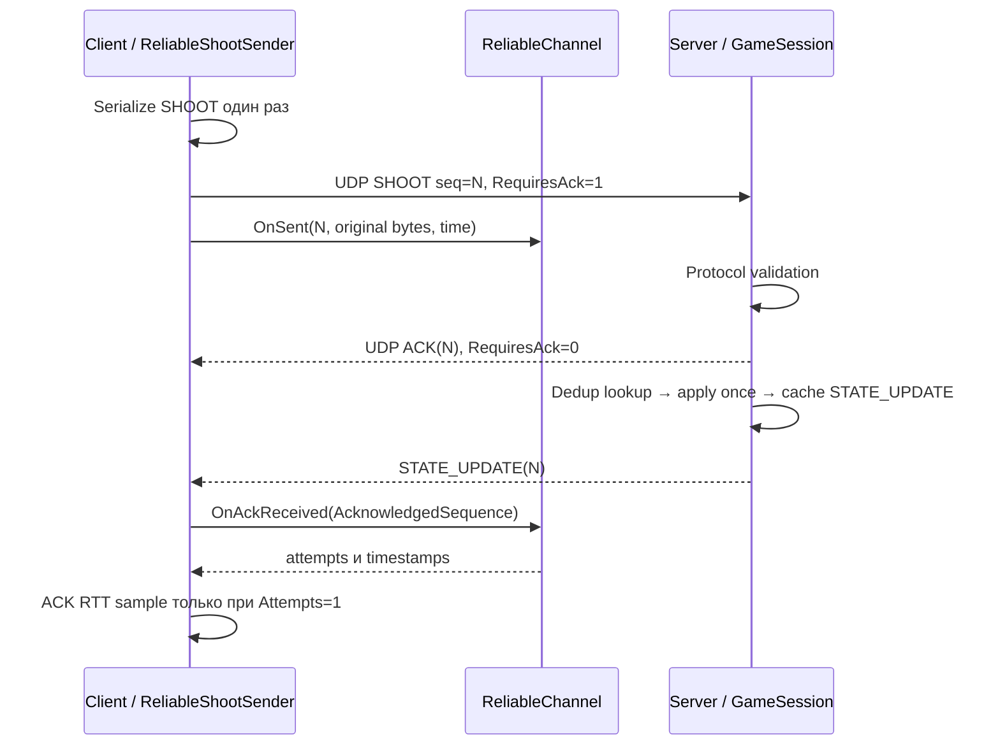
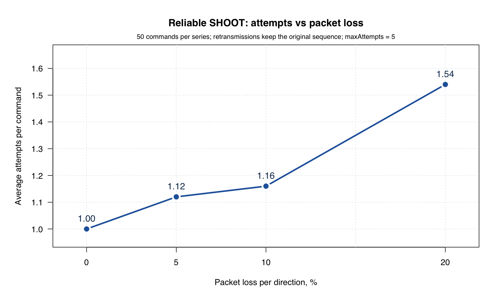
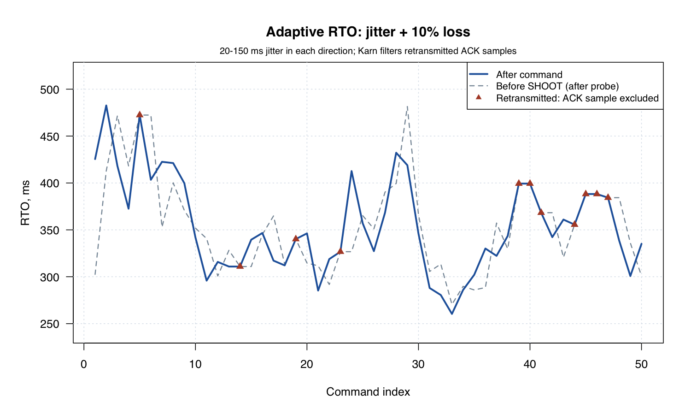

# Отчёт по надёжной доставке поверх UDP

## Состав команды

В доступной документации проекта ФИО и состав команды не указаны. Владелец репозитория GitHub — **teeeema**. Неустановленные участники в отчёт не добавлены.

## Архитектура

ПР №1 реализовала игровые команды по UDP, ПР №2 добавила измерения сети, ПР №3 добавляет надёжность критичных событий поверх того же бинарного протокола C# / .NET 10.

| Пакет | Политика |
|---|---|
| SHOOT | Reliable: RequiresAck=true, первоначальная попытка и до четырёх повторов |
| MOVEMENT | Unreliable: более свежие координаты заменяют старые |
| PING / PONG | Unreliable: измерения RTT без retransmission |
| ACK | Unreliable, RequiresAck=false; ACK-on-ACK запрещён |
| STATE_UPDATE | Прежняя семантика результата игровой команды, без собственного ACK |

SHOOT — дискретное событие: потеря пакета теряет действие игрока. Повторное выполнение тоже ошибочно, потому что увеличило бы ShotsFired дважды. MOVEMENT отправляется часто; повтор старой позиции может ухудшить актуальность состояния. ACK подтверждает получение корректного пакета, а не принятие команды игровой логикой: например, неверный WeaponId подтверждается ACK, но STATE_UPDATE сообщает OUT_OF_RANGE.

UdpGame.Protocol владеет wire format и validation. UdpGame.Reliability остаётся библиотекой без ProjectReference и socket IO. ClientDeliveryTracker на уровне Client связывает ReliableChannel, AdaptiveTimeout и TelemetryTracker. ReliableShootSender — общий реальный UDP-цикл обычного клиента и эксперимента. Transport владеет дейтаграммами и эмуляцией. GameSession на Server владеет состоянием конкретного endpoint и RecentCommandWindow.

Wire v2: header 8 байт, RequiresAck на offset 7; ACK=6, payload AcknowledgedSequence — UInt16 big-endian, ровно 2 байта. ACK целиком занимает 10 байт. [Полная спецификация](Protocol_Specification.md).



ACK отправляется до проверки duplicate и применения эффекта. Сеть может изменить порядок получения ACK и STATE_UPDATE. Клиент обычного режима ждёт подтверждения доставки SHOOT и STATE_UPDATE; после ACK он ждёт STATE_UPDATE не более --timeout-ms. Потеря одного STATE_UPDATE не отменяет подтверждение ACK и не запускает новый выстрел. Завершение без состояния отражается отдельным сообщением. Failed delivery логируется как приложенческое событие; клиент продолжает последующие команды. Итоговый exit code 2 сообщает неполноту сценария, а не аварийное исключение.

### Pending, retransmission и failed

OnSent копирует raw bytes, Attempts=1, FirstSentAtUs=LastSentAtUs=nowUs. Duplicate pending sequence вызывает InvalidOperationException без замены. CollectForRetransmission использует текущий RTO, переведённый из ms в us с округлением вверх. Он увеличивает Attempts, обновляет LastSentAtUs и возвращает исходные bytes с тем же sequence и RequiresAck=1. Один пакет не выбирается снова до следующего RTO. Коллекция считает попытку при выборе; вызывающий слой обязан её отправить, а эмулированный drop тоже считается попыткой.

MaxAttempts=5 означает первую отправку плюс максимум четыре повтора. После ожидания RTO пятой попытки пакет снимается с pending и попадает в failed; шестой отправки нет. PendingCount, FailedCount и read-only snapshots failed доступны для диагностики. FailedPacket хранит sequence, attempts, first/last send times. Duplicate/unknown/late-after-failed ACK безопасно игнорируется и не обновляет RTO.

### Server deduplication

RecentCommandWindow хранит Dictionary<ushort, StateUpdate> и Queue<ushort>, capacity=1024 **на endpoint**. Первый reliable packet применяется и его результат сохраняется. Duplicate получает ACK и точную копию прежнего STATE_UPDATE без изменения состояния, даже если payload с тем же ID изменён. Дубликат не продлевает историю; при заполнении вытесняется старейший ID по порядку первого получения.

UInt16 IDs сравниваются на равенство, а не через sequence <= lastSequence: переход 65535 → 0 не подавляет новую команду. Ранее вытесненный ID может снова примениться, поэтому exactly-once гарантируется только внутри retained window и текущего endpoint, а не навсегда.

Потеря ACK:

```mermaid
sequenceDiagram
    participant C as Client
    participant S as Server
    C->>S: SHOOT seq=N, RequiresAck=1
    S--xC: Первый ACK(N) потерян
    S->>S: ShotsFired += 1, cache response
    S-->>C: STATE_UPDATE(N), не заменяет ACK
    C->>C: RTO expired
    C->>S: Те же raw bytes, SHOOT seq=N
    S-->>C: Новый ACK(N)
    S->>S: Duplicate: не менять ShotsFired
    S-->>C: Cached STATE_UPDATE(N)
    C->>C: Delivered, Attempts=2; Karn: не брать ACK RTT
```

## Adaptive RTO

Константы: alpha=0.125, beta=0.25, min=100 ms, max=3000 ms. До первого sample IsInitialized=false, SRTT/RTTVAR=0 (ещё не оценки), RTO=1000 ms. OnSample принимает конечный неотрицательный RTT в ms.

```text
Первый sample:
SRTT   = RTTsample
RTTVAR = RTTsample / 2

Последующие samples (RTTVAR использует прежний SRTT):
RTTVAR = 0.75 * RTTVAR + 0.25 * abs(SRTT - RTTsample)
SRTT   = 0.875 * SRTT + 0.125 * RTTsample
RTO    = clamp(SRTT + 4 * RTTVAR, 100, 3000) ms
```

SRTT сглаживает обычную задержку, RTTVAR отражает её изменчивость. Чем менее стабильна сеть, тем больше запас ожидания. После стабильных samples запас уменьшается; нижняя граница не позволяет ретранслировать из-за совсем малых временных колебаний loopback.

Источники samples: успешные PING/PONG и ACK с Attempts==1. RTT PING вычисляется TelemetryTracker по клиентским монотонным часам; echo ClientSendTimeUs проверяется. Истёкшие, неизвестные или повторные PONG не становятся новыми samples. RTT ACK = (ackReceiveUs − FirstSentAtUs)/1000. **Karn:** при Attempts>1 неизвестно, какую отправку подтвердил ACK, поэтому Time-to-ACK фиксируется как время операции, но sample не используется для AdaptiveTimeout.

В обычном игровом режиме нет дополнительных PING; RTO обучается ACK. В ПР №3 перед каждым SHOOT отправляется один unreliable PING. В существующем ExperimentRunner ПР №2 успешные RTT также поступают в клиентский AdaptiveTimeout, но его timeout=1000 ms, CSV и расчёты TelemetryTracker не меняются. TCP backoff и полноценный TCP recovery здесь не реализованы.

## Эксперимент

Фактический запуск выполнен **9 октября 2026 года** на loopback Client/Server через реальные UDP-сокеты. Код запуска: `39c5146`. Это измеренный запуск программы, не генерация CSV математической симуляцией. [CSV](reliability_samples.csv), [вывод клиента](reliability_run.log), [лог сервера](reliability_server.log), [независимые агрегаты](reliability_summary.json).

6 серий × 50 исходных SHOOT = **300 delivery operations**. На серию создаются новые UdpTransport и ClientDeliveryTracker; endpoint и серверное состояние отдельные. SHOOT выполняются последовательно, без нескольких pending-команд. Между завершением операции и следующим PING — **50 ms**; после 50-й команды паузы нет. Перед каждым SHOOT выполняется один PING, ожидание PONG ограничено 1000 ms. Если PONG потерян, SHOOT всё равно запускается с последним RTO. Это не фиксированный период отправки: probes, ожидание ACK и retries увеличивают время серии.

Общий счётчик sequence использует 1..600: нечётные номера — PING, чётные — исходные SHOOT. Каждый retry сохраняет исходный чётный sequence. Повторного использования ID в этом запуске нет.

| Серия | Loss на каждое направление, % | Base delay на каждое направление, ms | Jitter на каждое направление, ms |
|---|---:|---:|---|
| baseline | 0 | 0 | 0 |
| loss_5 | 5 | 0 | 0 |
| loss_10 | 10 | 0 | 0 |
| loss_20 | 20 | 0 | 0 |
| delay_100_loss_5 | 5 | 100 | 0 |
| jitter_loss_10 | 10 | 0 | 20..150, равномерный целочисленный |

Seed исходящего эмулятора = **20261009**, входящего = **20261010**; генераторы переинициализируются на серию. Тот же общий NetworkEmulator используется для произвольных datagrams. На отправке эмулируются SHOOT/PING; на приёме — ACK/STATE_UPDATE/PONG. Сервер отправляет ACK через UDP без собственной эмуляции; входящий эмулятор клиента может отбросить уже полученную дейтаграмму **до** Deserialize/ACK handling. Поэтому модель проверяет потерю ACK и запросов, но не имитирует физическое место потери внутри маршрута.

Исходящий delay планируется Task.Delay; входящий — priority queue по монотонному времени. Receive возвращает управление каждые примерно 20 ms, пока delayed datagram не готов, поэтому retransmission loop продолжает работать. Порядок разных дейтаграмм может измениться. Фиксированный seed воспроизводит random decisions при одинаковом порядке вызовов, но не обещает идентичные timestamps или retries при иной нагрузке ОС.

### CSV и независимая проверка

Одна строка — одна исходная reliable-команда, всего **300 строк** без header. Колонки содержат series/index/sequence, времена относительно старта эксперимента, attempts/retransmissions, delivered/failed, Time-to-ACK, final RTO, Karn sample flag, loss/delay/jitter, оба seed, RTO перед SHOOT, RTT probe и накопленные drops двух направлений. Последние счётчики включают все datagrams, в том числе PING и STATE_UPDATE; они не являются отдельным счётчиком потерь ACK.

Delivered означает ACK-confirmed. Для failed отсутствуют ack timestamp и Time-to-ACK. AvgTimeToAckMs усредняется только по delivered; AvgAttempts учитывает также failed. FinalRtoMs — состояние после последней команды серии, не среднее RTO.

[Скрипт проверки](../scripts/analyze_reliability.py) независимо проверяет delivered+failed=sent, Attempts 1..5, retransmissions=attempts−1, времена, конечность чисел, уникальность sequence, clamp и Karn. Он восстанавливает **каждое обновление RTO** из probe/ACK samples CSV, пересчитывает агрегаты и сравнивает их с RESULT-строками программы. Все проверки прошли. Серверный лог дополнительно подтверждает 300 уникальных игровых эффектов и 29 duplicates, по 50 shots на каждый из шести endpoint.

```bash
python3 scripts/analyze_reliability.py
Rscript scripts/plot_reliability.R
```

Графический скрипт использует стандартный Base R, читает только фактический CSV и не меняет samples. На macOS применяется native Quartz PNG, на других системах — Cairo.

## Результаты

| Серия | Отправлено | Доставлено | Доставлено с 1-й попытки | Retransmit total | Failed | Avg attempts | Final RTO, ms | Time-to-ACK, ms |
|---|---:|---:|---:|---:|---:|---:|---:|---:|
| baseline | 50 | 50 | 50 | 0 | 0 | 1.00 | 100.000 | 0.184 |
| loss_5 | 50 | 50 | 45 | 6 | 0 | 1.12 | 100.000 | 13.337 |
| loss_10 | 50 | 50 | 44 | 8 | 0 | 1.16 | 100.000 | 17.821 |
| loss_20 | 50 | 49 | 32 | 27 | 1 | 1.54 | 100.000 | 51.258 |
| delay_100_loss_5 | 50 | 50 | 45 | 6 | 0 | 1.12 | 206.388 | 230.854 |
| jitter_loss_10 | 50 | 50 | 39 | 12 | 0 | 1.24 | 335.102 | 263.226 |

| Серия | FirstAttemptPercent | FailedPercent | MaxAttemptsObserved | Успешных probe samples | ACK samples для RTO |
|---|---:|---:|---:|---:|---:|
| baseline | 100% | 0% | 1 | 50 | 50 |
| loss_5 | 90% | 0% | 3 | 45 | 45 |
| loss_10 | 88% | 0% | 4 | 39 | 44 |
| loss_20 | 64% | 2% | 5 | 30 | 32 |
| delay_100_loss_5 | 90% | 0% | 3 | 45 | 45 |
| jitter_loss_10 | 78% | 0% | 3 | 39 | 39 |

Итого: **300 sent, 299 delivered, 255 delivered first attempt, 59 retransmissions, 1 failed**. Baseline действительно обошёлся без повторов. Данные CSV не исправлялись вручную.

## Графики

### Среднее число попыток против потерь



Для baseline/loss_5/loss_10/loss_20 среднее выросло 1.00 → 1.12 → 1.16 → 1.54. X — номинальная вероятность потери **на каждое направление**, а не измеренный процент failed операций.

### Adaptive RTO при jitter_loss_10



Синяя линия — RTO после команды, серая — после probe перед SHOOT. Треугольники отмечают операции с retransmission: их ACK RTT не обновляет RTO. Значения RTO после команд находились в **260.399..482.623 ms**, финальное — **335.102 ms**. Пунктир и синяя линия могут отличаться только там, где допустим новый ACK sample.

## Анализ

1. При стабильном loopback RTO упирается в min=100 ms. В delay_100_loss_5 финальный RTO вырос до 206.388 ms; при jitter — до 335.102 ms, меняясь с разбросом samples. В ПР №2 fixed timeout остаётся 1000 ms независимо от samples. Здесь адаптивное ожидание обычно короче, но это не контролируемое сравнение скорости восстановления: ПР №2 не повторяет PING, а задержка ПР №3 применяется в обе стороны, в отличие от исходящего-only эмулятора ПР №2.
2. В loss_20 только 32/50 операций подтвердились с первой попытки, 49/50 завершились ACK, среднее число попыток 1.54. Потери 20% действуют отдельно на запрос и ACK; для независимых направлений вероятность успешного полного обмена с первой попытки теоретически около (1−0.2)^2=64%, что согласуется с этим конкретным запуском. Это не требование точного процента для любого seed.
3. Всего выполнено 59 retransmissions, из них 27 в loss_20. Счётчик включает четыре повтора failed-команды и повторы, которые эмулятор удалил до отправки. Сервер получил лишь 29 дубликатов: остальные повторные попытки могли восстанавливать потерянный исходный SHOOT либо сами теряться.
4. Один failed — loss_20, command_index=6, sequence=312, пять attempts при RTO=100 ms. Серверный лог показывает первое принятие и ещё три duplicates с неизменным ShotsFired=6. Следовательно, действие было выполнено один раз, но ни один ACK этой операции не был принят клиентом до исчерпания лимита. **Failed означает отсутствие подтверждения, а не отсутствие игрового эффекта.** Поздний ACK не отменяет уже завершённый failed.
5. GameSession перед применением эффекта проверяет RecentCommandWindow. Cached response возвращается на duplicate, и счётчик выстрелов не увеличивается. В полном запуске каждый из 300 sequence применён ровно один раз, несмотря на 29 server duplicates.
6. ACK loss вызывает повтор того же SHOOT, а не новую команду. Сервер повторно ACK-ает retained ID, но не выполняет эффект. Automated test `LostAckCausesRetransmissionWithoutDuplicateShootEffect` проверяет это через реальные UDP-сокеты, детерминированно удаляя первый ACK; клиент доставляет команду со второй попытки, ShotsFired=1, RTO не обучается её ACK по Karn.
7. MOVEMENT остаётся unreliable, поскольку более свежая позиция полезнее повторной доставки устаревшей. В обычном smoke-сценарии MOVEMENT/SHOOT/STATE_UPDATE работают совместно; SHOOT подтверждается отдельным ACK.

## Проверки регрессии

- `dotnet restore`, `dotnet build UdpGame.sln`, `dotnet test UdpGame.sln`: PASS, build без ошибок и предупреждений в итоговом прогоне.
- **78 tests passed, 0 failed**: 21 Protocol, 10 Telemetry, 27 Reliability, 20 Integration. Все прежние 58 тестов сохранены.
- ПР №1: реальный обычный клиент, 6/6 STATE_UPDATE, три ACK reliable SHOOT, итоговые ShotsFired=3.
- ПР №2: полный существующий эксперимент 6×50 PING, 295 received, 5 timeout; exit=0. Исходный docs/latency_samples.csv сохранён, регрессионный CSV был временным. [Вывод запуска](pr2_regression.log).
- ПР №3: реальный эксперимент, 300 строк; независимая проверка CSV/RTO/агрегатов и server effects PASS.

## Ограничения

- Sequence UInt16, без session identifier. В данном эксперименте ID уникальны; автоматического безопасного rollover клиентского счётчика для бесконечной сессии нет. Server window допускает 65535 → 0, но не определяет глобальный порядок пакетов.
- Late ACK после повторного использования ID может снять новый pending; слишком поздний duplicate после вытеснения ID может повторить эффект. Смена endpoint создаёт другую сессию; повторное использование endpoint после перезапуска также не защищено.
- Dedup ограничен 1024 retained commands на endpoint, без TTL; endpoint sessions сервер хранит до остановки. Failed history в ReliableChannel сохраняется на срок жизни канала без ограничения размера; в эксперименте новый канал создаётся на серию.
- ACK отправляется до игрового эффекта и не является durable commit. Авария сервера после ACK, но до применения эффекта, не компенсируется. ACK не аутентифицирован; клиентский connected UDP фильтрует endpoint, но криптографической защиты нет.
- STATE_UPDATE ненадёжен. Его потеря не меняет delivered по ACK и может оставить обычный клиент без видимого результата команды. Cached duplicate STATE_UPDATE содержит прежний снимок, а не новое состояние последующих команд.
- MaxAttempts=5 и maxRTO=3000 ms ограничивают ожидание, но не гарантируют подтверждение при любых потерях; TCP-style exponential backoff не реализован.
- Программная эмуляция на loopback не заменяет WAN, congested router или Unity/VR runtime. Random seed не фиксирует планирование ОС. Данные одного запуска по 50 команд не устанавливают доверительные интервалы и не гарантируют такую же долю failed в следующем запуске.

## Вывод

Реальный Client/Server обмен подтвердил работу reliable SHOOT, повторов исходных bytes, ACK, adaptive RTO, Karn и ограниченной серверной дедупликации. Подтверждены 299 из 300 операций с 59 повторами; единственная failed-команда была выполнена сервером один раз, но осталась неподтверждённой клиенту. ПР №1 и №2 сохранили работоспособность. Результат показывает восстановление доставки в пределах лимита попыток и retained window, а не безусловную exactly-once гарантию.
