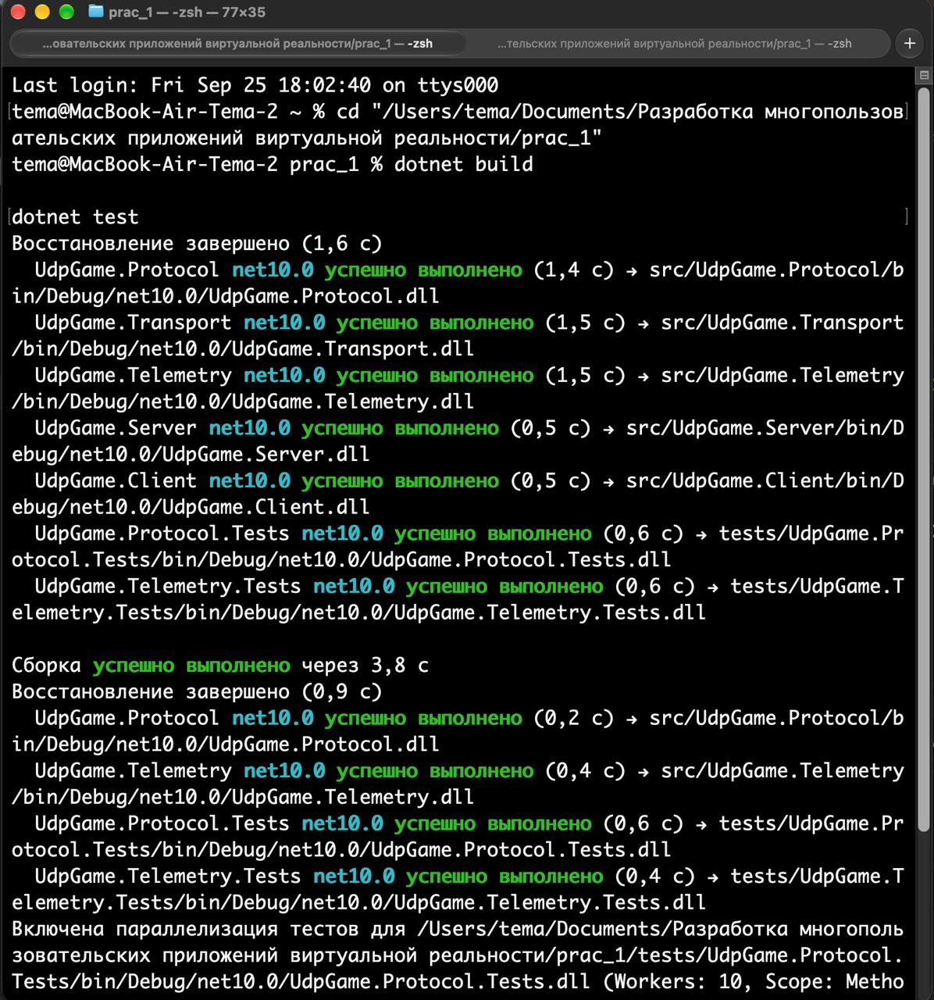
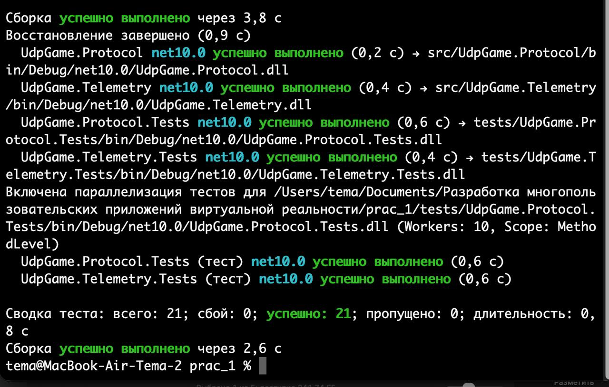
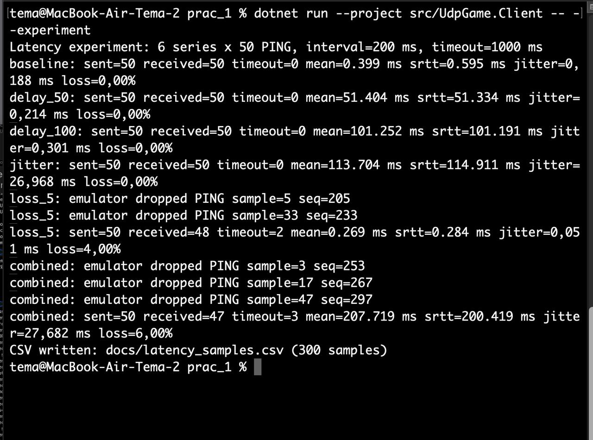
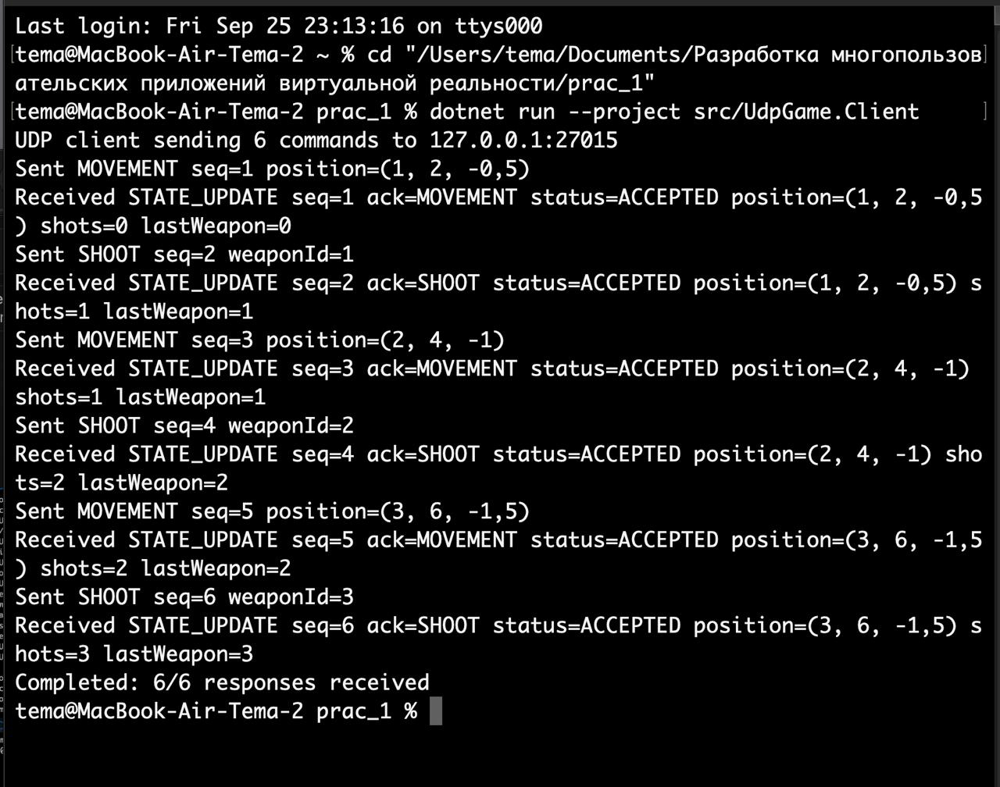
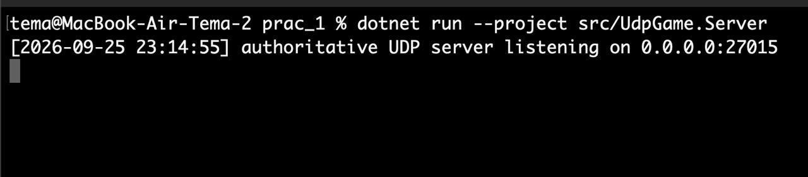
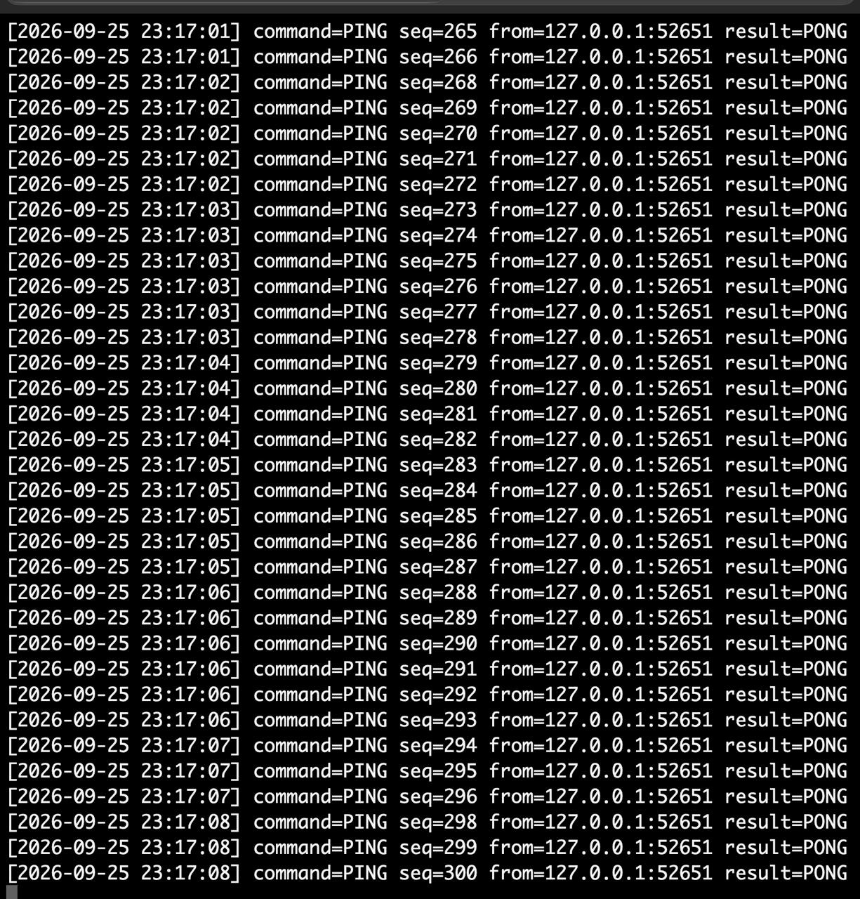

# Демонстрация запуска практической работы №2

## 1. Сборка проекта и тесты

``` bash
cd "/Users/tema/Documents/Разработка многопользовательских приложений виртуальной реальности/prac_1"
dotnet build
dotnet test
```





Результат: проект успешно собирается, выполнен 21 тест, ошибок и
пропущенных тестов нет.

------------------------------------------------------------------------

## 2. Запуск сервера

В первом терминале:

``` bash
cd "/Users/tema/Documents/Разработка многопользовательских приложений виртуальной реальности/prac_1"
dotnet run --project src/UdpGame.Server
```



Сервер запущен на UDP-порту `27015` и остаётся работать во время
следующих этапов.

------------------------------------------------------------------------

## 3. Запуск обычного клиента

Во втором терминале:

``` bash
cd "/Users/tema/Documents/Разработка многопользовательских приложений виртуальной реальности/prac_1"
dotnet run --project src/UdpGame.Client
```



Клиент отправляет команды `MOVEMENT` и `SHOOT`, а сервер возвращает
`STATE_UPDATE`. В конце получено `6/6` ответов.

------------------------------------------------------------------------

## 4. Запуск эксперимента

Сервер из первого терминала оставляем запущенным.

Во втором терминале:

``` bash
dotnet run --project src/UdpGame.Client -- --experiment
```



Эксперимент содержит 6 серий по 50 `PING` --- всего 300 измерений.
Интервал отправки --- 200 мс, тайм-аут --- 1000 мс.

Профили:

-   `baseline`
-   `delay_50`
-   `delay_100`
-   `jitter`
-   `loss_5`
-   `combined`

------------------------------------------------------------------------

## 5. PING/PONG на сервере

Во время эксперимента в терминале сервера отображаются полученные `PING`
и сформированные ответы `PONG`.



В профилях с искусственными потерями некоторые номера последовательности
отсутствуют в серверном выводе, потому что соответствующие `PING` были
отброшены эмулятором до отправки серверу.

------------------------------------------------------------------------

## 6. Результаты эксперимента

В текущем запуске:

  ---------------------------------------------------------------------------------------
  Профиль       Отправлено   Получено   Тайм-ауты   Средний      SRTT    Jitter    Потери
                                                        RTT                     
  ----------- ------------ ---------- ----------- --------- --------- --------- ---------
  baseline              50         50           0  0.399 мс  0.595 мс  0.188 мс        0%

  delay_50              50         50           0 51.404 мс 51.334 мс  0.214 мс        0%

  delay_100             50         50           0   101.252   101.191  0.301 мс        0%
                                                         мс        мс           

  jitter                50         50           0   113.704   114.911 26.968 мс        0%
                                                         мс        мс           

  loss_5                50         48           2  0.269 мс  0.284 мс  0.051 мс        4%


Всего выполнено 300 измерений: 295 ответов получено, 5 запросов
завершились по тайм-ауту.

После выполнения создаётся:

``` text
docs/latency_samples.csv
```


