# Демонстрация запуска практической работы №3

## Надёжная доставка игровых команд поверх UDP

Практическая работа №3 продолжает проект из ПР №1 и ПР №2.  
В этой работе команда `SHOOT` стала надёжной: клиент ждёт `ACK`, при необходимости повторяет тот же пакет с тем же `SequenceNumber`, а сервер защищён от повторного применения одной и той же команды.

В демонстрации ниже показаны:

- сборка решения и прохождение тестов;
- запуск UDP-сервера;
- обычный обмен `MOVEMENT` / `SHOOT`;
- получение `ACK`;
- повторная передача `SHOOT` при потере;
- ограничение числа попыток;
- адаптивный `RTO`;
- полный reliability experiment из 6 серий по 50 команд.

---

## 1. Сборка и автоматические тесты

Перед запуском выполняются:

```bash
dotnet restore
dotnet build UdpGame.sln
dotnet test UdpGame.sln --no-build
```

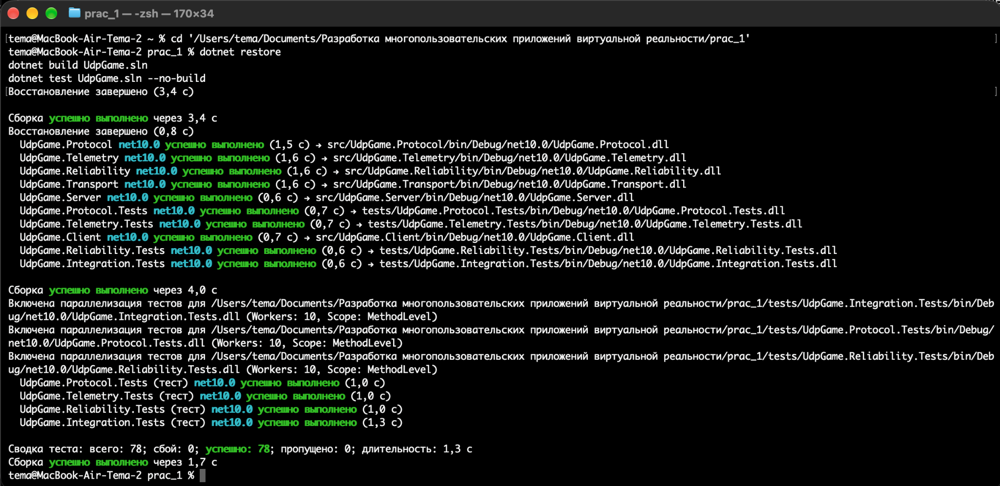

На скриншоте видно, что успешно собираются основные проекты:

- `UdpGame.Protocol`;
- `UdpGame.Telemetry`;
- `UdpGame.Reliability`;
- `UdpGame.Transport`;
- `UdpGame.Server`;
- `UdpGame.Client`.

Также успешно проходят тестовые проекты:

- `UdpGame.Protocol.Tests`;
- `UdpGame.Telemetry.Tests`;
- `UdpGame.Reliability.Tests`;
- `UdpGame.Integration.Tests`.

Итог тестирования:

```text
Всего: 78
Успешно: 78
Сбой: 0
Пропущено: 0
```

Это подтверждает, что код ПР №3 проходит как модульные, так и интеграционные проверки.

---

## 2. Запуск UDP-сервера

Сервер запускается отдельным процессом:

```bash
dotnet run --project src/UdpGame.Server -- \
  --port 27015 \
  --log docs/reliability_server_new.log
```

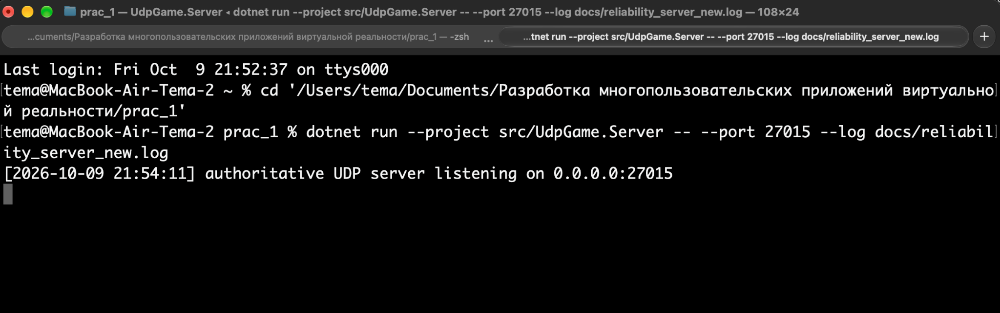

В выводе:

```text
authoritative UDP server listening on 0.0.0.0:27015
```

Сервер успешно запущен и ожидает UDP-пакеты на порту `27015`.

---

## 3. Короткая демонстрация обычного клиент-серверного обмена

Клиент запускается командой:

```bash
dotnet run --project src/UdpGame.Client -- \
  --host 127.0.0.1 \
  --port 27015 \
  --count 6 \
  --interval-ms 500 \
  --timeout-ms 2000
```

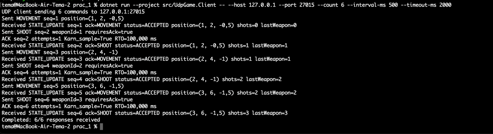

В обычном режиме клиент по очереди отправляет `MOVEMENT` и `SHOOT`.

### MOVEMENT

Для `MOVEMENT` видно:

```text
Sent MOVEMENT seq=1 ...
Received STATE_UPDATE seq=1 ...
```

`MOVEMENT` остаётся ненадёжной командой: отдельный `ACK` для неё не требуется.

### SHOOT

Для `SHOOT` видно:

```text
Sent SHOOT seq=2 weaponId=1 requiresAck=true
ACK seq=2 attempts=1 Karn_sample=True RTO=100,000 ms
Received STATE_UPDATE seq=2 ...
```

То есть:

1. `SHOOT` отправляется с `RequiresAck=true`;
2. сервер отвечает `ACK`;
3. `attempts=1` означает, что повторная отправка не потребовалась;
4. `Karn_sample=True` означает, что ACK получен после первой отправки и это измерение можно использовать при расчёте `RTO`;
5. `STATE_UPDATE` подтверждает изменение игрового состояния.

За три команды `SHOOT` счётчик увеличивается:

```text
shots=1
shots=2
shots=3
```

В конце:

```text
Completed: 6/6 responses received
```

---

## 4. Обработка команд на сервере

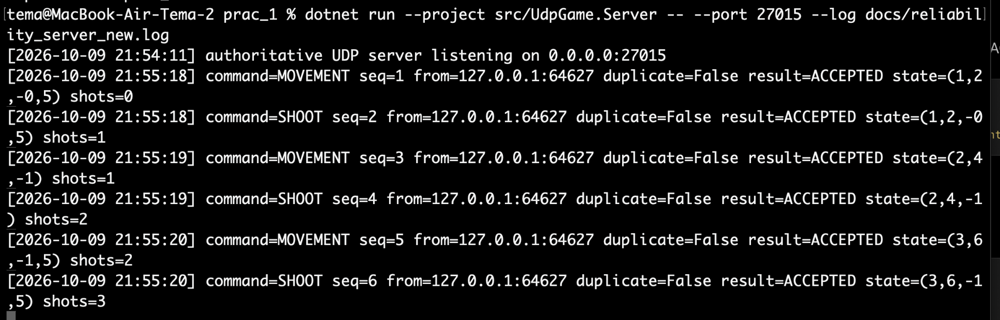

Сервер регистрирует каждую полученную команду.

Например:

```text
command=SHOOT seq=2 ... duplicate=False ... shots=1
command=SHOOT seq=4 ... duplicate=False ... shots=2
command=SHOOT seq=6 ... duplicate=False ... shots=3
```

Поле:

```text
duplicate=False
```

означает, что это первая обработка данного `SequenceNumber`.

В коротком запуске потерь нет, поэтому повторных команд не возникает.

---

# 5. Полный reliability experiment

Эксперимент запускается командой:

```bash
dotnet run --project src/UdpGame.Client -- \
  --host 127.0.0.1 \
  --port 27015 \
  --reliability-experiment \
  --csv docs/reliability_samples_new.csv \
  | tee docs/reliability_run_new.log
```

Эксперимент содержит 6 серий:

1. `baseline`;
2. `loss_5`;
3. `loss_10`;
4. `loss_20`;
5. `delay_100_loss_5`;
6. `jitter_loss_10`.

В каждой серии отправляется по 50 reliable-команд `SHOOT`.

Всего:

```text
6 × 50 = 300 команд
```

---

## 5.1. Baseline

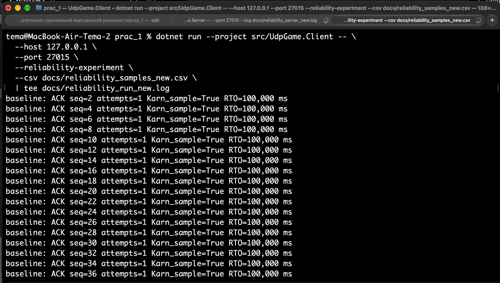

В baseline потери и искусственная задержка отсутствуют.

Практически каждый пакет выглядит так:

```text
baseline: ACK seq=... attempts=1 Karn_sample=True RTO=100,000 ms
```

Это означает:

- ACK пришёл после первой попытки;
- retransmission не требуется;
- RTT sample можно использовать для адаптации RTO.

Итог серии:

```text
sent=50
delivered=50
first_attempt=50
retransmit_total=0
failed=0
avg_attempts=1.000000
avg_time_to_ack_ms=0.143880
final_rto_ms=100.000000
```

Baseline используется как эталон.

---

## 5.2. Потери 5% — `loss_5`

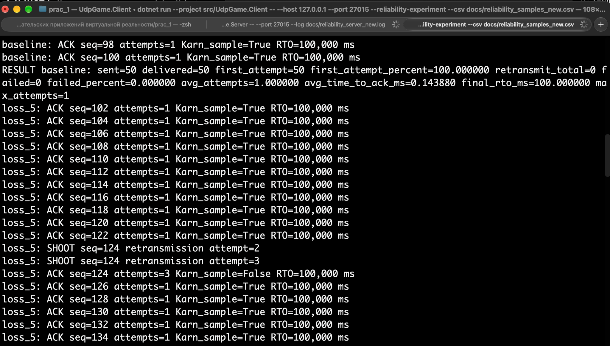

В этой серии впервые видны реальные повторные отправки.

Показательный пример:

```text
loss_5: SHOOT seq=124 retransmission attempt=2
loss_5: SHOOT seq=124 retransmission attempt=3
loss_5: ACK seq=124 attempts=3 Karn_sample=False
```

Что происходит:

1. команда `SHOOT seq=124` была отправлена;
2. ACK не пришёл за время `RTO`;
3. клиент повторил тот же пакет;
4. после второй повторной отправки ACK был получен;
5. `attempts=3` означает три общие попытки;
6. `Karn_sample=False` — ACK после retransmission не используется как новый RTT sample.

Итог:

```text
sent=50
delivered=50
first_attempt=45
retransmit_total=6
failed=0
avg_attempts=1.120000
avg_time_to_ack_ms=12.942960
final_rto_ms=100.000000
```

Несмотря на потери, все 50 команд подтверждены.

---

## 5.3. Потери 10% — `loss_10`

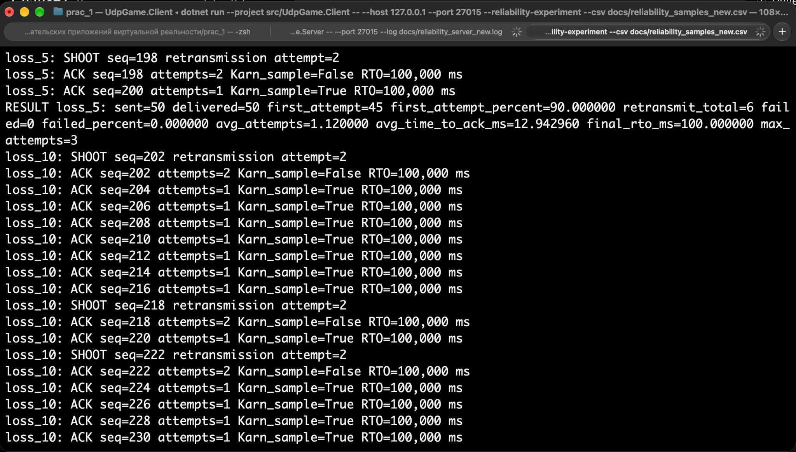

При увеличении потерь retransmission происходит чаще.

На скриншоте видны, например:

```text
SHOOT seq=202 retransmission attempt=2
SHOOT seq=218 retransmission attempt=2
SHOOT seq=222 retransmission attempt=2
```

Итог:

```text
sent=50
delivered=50
first_attempt=44
retransmit_total=8
failed=0
avg_attempts=1.160000
avg_time_to_ack_ms=17.113760
final_rto_ms=100.000000
```

По сравнению с `loss_5` среднее количество попыток увеличилось.

---

## 5.4. Потери 20% — `loss_20`

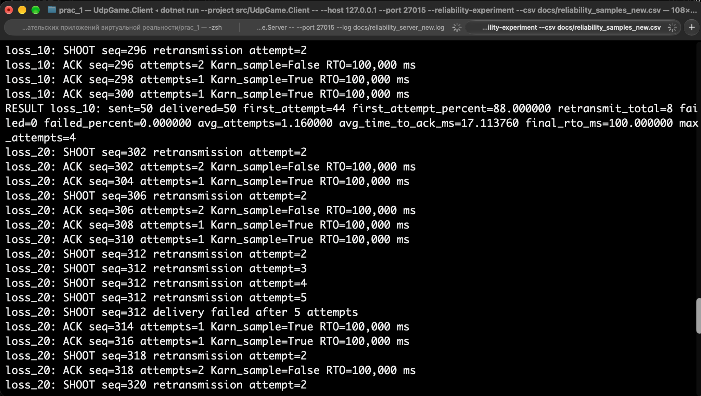

Это самая тяжёлая серия только с потерями.

Самый показательный случай:

```text
loss_20: SHOOT seq=312 retransmission attempt=2
loss_20: SHOOT seq=312 retransmission attempt=3
loss_20: SHOOT seq=312 retransmission attempt=4
loss_20: SHOOT seq=312 retransmission attempt=5
loss_20: SHOOT seq=312 delivery failed after 5 attempts
```

Клиент исчерпал допустимое число попыток:

```text
maxAttempts = 5
```

После этого доставка считается `failed`.

Важно: `failed` означает, что клиент не получил ACK после пяти попыток. Сам по себе этот статус не доказывает, что сервер вообще не получал пакет.

Итог серии:

```text
sent=50
delivered=49
first_attempt=32
first_attempt_percent=64.000000
retransmit_total=27
failed=1
failed_percent=2.000000
avg_attempts=1.540000
avg_time_to_ack_ms=49.960265
final_rto_ms=100.000000
max_attempts=5
```

---

## 5.5. Задержка 100 ms + потери 5% — `delay_100_loss_5`

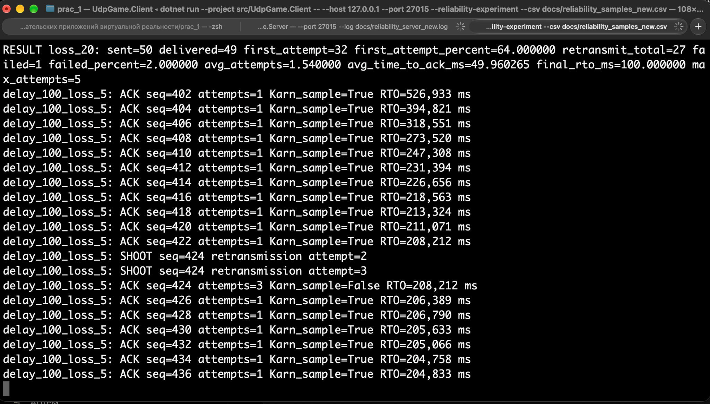

В этой серии особенно хорошо видна работа Adaptive RTO.

В начале:

```text
RTO=526,933 ms
```

Затем значение постепенно уменьшается:

```text
394,821 ms
318,551 ms
273,520 ms
247,308 ms
...
205 ms
```

То есть RTO не является постоянной величиной.

Клиент наблюдает RTT и постепенно подстраивает время ожидания ACK под фактическую сеть.

Также видно:

```text
SHOOT seq=424 retransmission attempt=2
SHOOT seq=424 retransmission attempt=3
ACK seq=424 attempts=3 Karn_sample=False
```

После retransmission значение ACK не используется как RTT sample из-за принципа Karn.

Итог:

```text
sent=50
delivered=50
first_attempt=45
retransmit_total=6
failed=0
avg_attempts=1.120000
avg_time_to_ack_ms=228.911020
final_rto_ms=204.464785
max_attempts=3
```

---

## 5.6. Jitter + потери 10% — `jitter_loss_10`

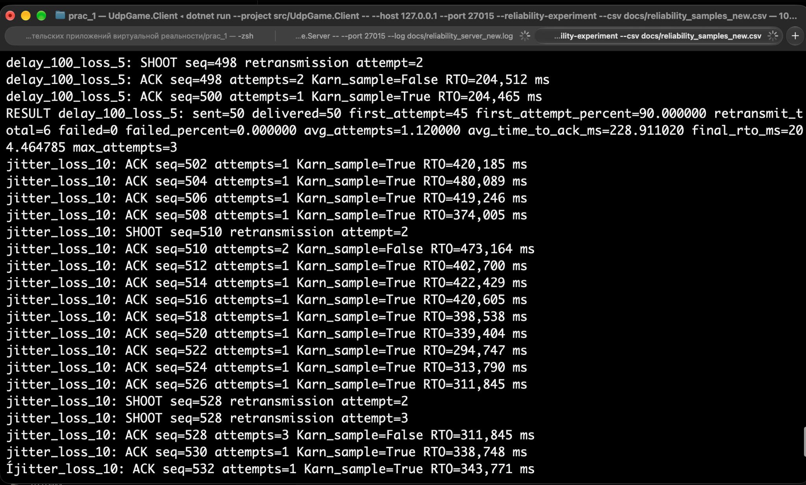

Здесь задержка постоянно меняется.

Поэтому меняется и RTO:

```text
420,185 ms
480,089 ms
419,246 ms
374,005 ms
...
339,404 ms
...
```

Также регулярно возникают retransmission:

```text
SHOOT seq=510 retransmission attempt=2
SHOOT seq=528 retransmission attempt=2
SHOOT seq=528 retransmission attempt=3
```

Так Adaptive RTO реагирует на нестабильный канал.

---

## 6. Завершение эксперимента

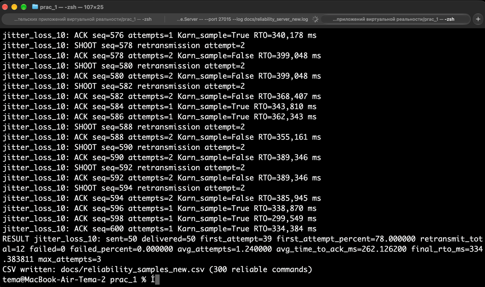

В конце серии `jitter_loss_10` видно:

```text
sent=50
delivered=50
first_attempt=39
first_attempt_percent=78.000000
retransmit_total=12
failed=0
avg_attempts=1.240000
avg_time_to_ack_ms=262.126200
final_rto_ms=334.383811
max_attempts=3
```

После завершения всех шести серий:

```text
CSV written: docs/reliability_samples_new.csv (300 reliable commands)
```

Таким образом, полный эксперимент успешно обработал все 300 исходных команд и сохранил результаты в CSV.

---

# 7. Итоговые результаты нового запуска

| Серия | Доставлено | С первой попытки | Retransmissions | Failed | Avg attempts | Avg time to ACK, ms | Final RTO, ms |
|---|---:|---:|---:|---:|---:|---:|---:|
| `baseline` | 50/50 | 50 | 0 | 0 | 1.00 | 0.144 | 100.000 |
| `loss_5` | 50/50 | 45 | 6 | 0 | 1.12 | 12.943 | 100.000 |
| `loss_10` | 50/50 | 44 | 8 | 0 | 1.16 | 17.114 | 100.000 |
| `loss_20` | 49/50 | 32 | 27 | 1 | 1.54 | 49.960 | 100.000 |
| `delay_100_loss_5` | 50/50 | 45 | 6 | 0 | 1.12 | 228.911 | 204.465 |
| `jitter_loss_10` | 50/50 | 39 | 12 | 0 | 1.24 | 262.126 | 334.384 |

Результаты подтверждают ожидаемую зависимость:

```text
больше потерь
→ больше retransmissions
→ выше среднее количество attempts
```

А при росте задержки и её изменчивости:

```text
RTT / jitter растёт
→ AdaptiveTimeout увеличивает RTO
```

---

# 8. Что демонстрирует ПР №3

В результате запуска подтверждены основные механизмы практической работы:

- `SHOOT` работает как reliable-команда;
- `RequiresAck=true` передаётся в заголовке;
- сервер присылает `ACK`;
- при отсутствии ACK выполняется retransmission;
- используется тот же `SequenceNumber`;
- число попыток ограничено;
- возможен контролируемый `failed`;
- ACK после retransmission не используется для RTT согласно принципу Karn;
- Adaptive RTO изменяется в зависимости от условий сети;
- результаты полного эксперимента сохраняются в CSV.

---

# 9. Краткий вывод

В ПР №3 поверх UDP реализован собственный механизм надёжной доставки критичных игровых команд.

UDP по-прежнему остаётся транспортом, но для `SHOOT` приложение самостоятельно реализует:

```text
отправка
→ ожидание ACK
→ Adaptive RTO
→ retransmission
→ ограничение attempts
→ success / failed
```

На стороне сервера механизм дополняется защитой от повторной обработки одного и того же `SequenceNumber`.

Фактический запуск показывает, что механизм работает как в нормальных условиях, так и при потерях, задержке и jitter.
