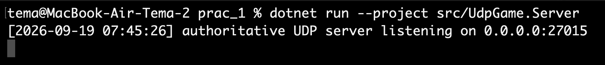
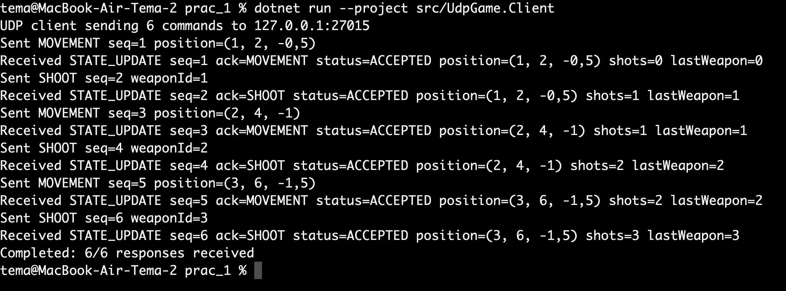
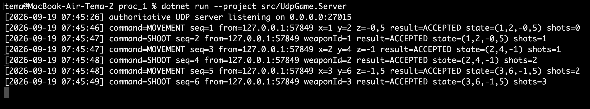

# Демонстрация работы UDP-протокола

## 1. Цель демонстрации

Цель — проверить обмен UDP-пакетами между клиентом и авторитетным сервером. Клиент поочерёдно отправляет `MOVEMENT` и `SHOOT`, сервер обрабатывает команды, изменяет своё состояние и возвращает `STATE_UPDATE`.

## 2. Запуск сервера

```bash
dotnet run --project src/UdpGame.Server
```



Строка `authoritative UDP server listening on 0.0.0.0:27015` показывает, что сервер запущен и прослушивает UDP-порт `27015`. `0.0.0.0` означает прослушивание доступных IPv4-интерфейсов.

## 3. Запуск клиента

Во втором терминале:

```bash
dotnet run --project src/UdpGame.Client
```

Без параметров используются настройки по умолчанию: сервер `127.0.0.1`, порт `27015`, 6 команд, интервал 500 мс, тайм-аут ответа 2000 мс.



Клиент отправил 6 команд и получил 6 ответов:

```text
Completed: 6/6 responses received
```

## 4. Последовательность обмена

1. `MOVEMENT seq=1 position=(1, 2, -0,5)` → сервер возвращает `STATE_UPDATE seq=1`, `ack=MOVEMENT`, `status=ACCEPTED`. Позиция становится `(1, 2, -0,5)`.
2. `SHOOT seq=2 weaponId=1` → `STATE_UPDATE seq=2`, `shots=1`, `lastWeapon=1`.
3. `MOVEMENT seq=3 position=(2, 4, -1)` → позиция становится `(2, 4, -1)`, число выстрелов остаётся 1.
4. `SHOOT seq=4 weaponId=2` → `shots=2`, `lastWeapon=2`.
5. `MOVEMENT seq=5 position=(3, 6, -1,5)` → позиция становится `(3, 6, -1,5)`, число выстрелов остаётся 2.
6. `SHOOT seq=6 weaponId=3` → `shots=3`, `lastWeapon=3`.

## 5. Журнал сервера



Сервер зарегистрировал все шесть команд:

| SequenceNumber | Команда | Данные | Результат |
|---:|---|---|---|
| 1 | `MOVEMENT` | `(1, 2, -0,5)` | `ACCEPTED` |
| 2 | `SHOOT` | `weaponId=1` | `ACCEPTED` |
| 3 | `MOVEMENT` | `(2, 4, -1)` | `ACCEPTED` |
| 4 | `SHOOT` | `weaponId=2` | `ACCEPTED` |
| 5 | `MOVEMENT` | `(3, 6, -1,5)` | `ACCEPTED` |
| 6 | `SHOOT` | `weaponId=3` | `ACCEPTED` |

`from=127.0.0.1:57849` означает, что пакет пришёл от клиента на локальном компьютере. `57849` — временный UDP-порт клиента, автоматически назначенный операционной системой для этого запуска. Сервер слушает свой порт `27015`.

## 6. Проверка SequenceNumber

```text
MOVEMENT seq=1 -> STATE_UPDATE seq=1
SHOOT    seq=2 -> STATE_UPDATE seq=2
MOVEMENT seq=3 -> STATE_UPDATE seq=3
SHOOT    seq=4 -> STATE_UPDATE seq=4
MOVEMENT seq=5 -> STATE_UPDATE seq=5
SHOOT    seq=6 -> STATE_UPDATE seq=6
```

Номер запроса совпадает с номером ответа, поэтому клиент может сопоставить `STATE_UPDATE` с отправленной командой. `SequenceNumber` не гарантирует доставку UDP-пакета, а служит для идентификации и сопоставления сообщений.

## 7. Изменение авторитетного состояния

| После команды | Позиция | ShotsFired | LastWeaponId |
|---|---|---:|---:|
| `MOVEMENT seq=1` | `(1, 2, -0,5)` | 0 | 0 |
| `SHOOT seq=2` | `(1, 2, -0,5)` | 1 | 1 |
| `MOVEMENT seq=3` | `(2, 4, -1)` | 1 | 1 |
| `SHOOT seq=4` | `(2, 4, -1)` | 2 | 2 |
| `MOVEMENT seq=5` | `(3, 6, -1,5)` | 2 | 2 |
| `SHOOT seq=6` | `(3, 6, -1,5)` | 3 | 3 |

`MOVEMENT` изменяет координаты, но не счётчик выстрелов. `SHOOT` увеличивает `ShotsFired` и обновляет `LastWeaponId`, но не изменяет координаты.

## 8. Вывод

Демонстрация подтверждает двусторонний UDP-обмен. Клиент успешно отправил три `MOVEMENT` и три `SHOOT`. Сервер обработал все шесть команд со статусом `ACCEPTED`, сохранил авторитетное состояние и на каждую команду вернул `STATE_UPDATE` с соответствующим `SequenceNumber`.

```text
6 отправленных команд
6 полученных STATE_UPDATE
6 команд со статусом ACCEPTED
Completed: 6/6 responses received
```
